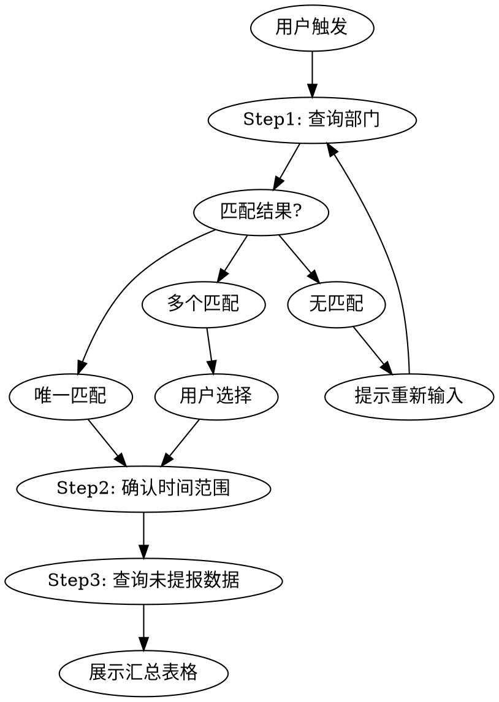

# 查询未提报工时

## Overview

通过 TSM 系统查询指定部门、时间范围内未提报工时的人员列表。三步交互：确认部门 → 确认时间 → 展示结果。

## When to Use

- 用户说"查询未提报工时"、"谁没提报工时"、"未提交工时"
- 需要查看某部门在某个时间段内的工时缺报情况

## 执行流程



### Step 1: 确认部门

```bash
python ${CLAUDE_SKILL_DIR}/scripts/tsm_query.py org-tree --keyword "<部门关键词>"
```

脚本返回 JSON，包含 `total`（全量部门数）、`matched`（匹配数）、`departments` 数组。

**匹配规则:**
- `matched = 1` → 直接使用该部门 `id`，进入 Step 2
- `matched > 1` → 列出匹配项让用户确认（支持多选）
- `matched = 0` → 提示用户重新输入

### Step 2: 确认时间范围

- 未指定 → 默认上月月初到月末（脚本自动计算），展示给用户确认
- 用户指定 → 使用用户提供的日期（`YYYY-MM-DD`）

### Step 3: 查询并展示

```bash
python ${CLAUDE_SKILL_DIR}/scripts/tsm_query.py query --dept-ids "<id1,id2>" --begin-date "YYYY-MM-DD" --end-date "YYYY-MM-DD"
```

省略日期参数则自动使用上月范围。脚本自动处理分页，返回全量数据。

脚本执行逻辑

1. 系统已内置工具 **`transsion_get_token`**（由 `extensions/transsion` 注册，与当前网关会话一致）。
2. 访问 `*.transsion.com` 的业务接口前，**先调用** `transsion_get_token`，使用返回结果中的 **`httpHeadersForApis`** 作为请求头（或等价地按其中字段设置头），再发起业务 HTTP 请求。
3. **无需**在文档中引导「自行实现换端」或「自行推导 `p-auth` / `p-rtoken`」；也无需在 Skill 内为实现鉴权而新增脚本代码（除非另有方案二需求）。

## Quick Reference

| 操作 | 命令 |
|------|------|
| 模糊查部门 | `python scripts/tsm_query.py org-tree -k "关键词"` |
| 列全量部门 | `python scripts/tsm_query.py org-tree` |
| 查未提报 | `python scripts/tsm_query.py query -d "id1,id2" -b "2026-03-01" -e "2026-03-31"` |
| 默认上月 | `python scripts/tsm_query.py query -d "id1,id2"` |

## 展示格式

将 Step 3 返回的 JSON 转为 Markdown 表格：

```markdown
查询部门：<部门名称> | 时间范围：<beginDate> ~ <endDate>

> 汇总：共 **N** 人，未提报总天数 **M** 天

| No. | 姓名   | 工号     | 未提报天数 | 部门                              |
|-----|--------|----------|-----------|-----------------------------------|
| 1   | 李梦雪 | 18657823 | 22        | 手机BG变革管理办公室/TO_研发变革组 |
```

| 列名 | 字段 | 说明 |
|------|------|------|
| No. | - | 从 1 自增 |
| 姓名 | workerName | |
| 工号 | worker | |
| 未提报天数 | noneSubmissionDays | |
| 部门 | deptNameFirst/deptNameSecond/deptNameThird | 用 `/` 组合，跳过 null |

## Implementation

- **脚本:** `scripts/tsm_query.py`（Python 3，无第三方依赖）
- **配置:** `scripts/tsm_config.json`（存放 `p-auth` 和 `p-rtoken`，token 过期需更新此文件）
- **前置条件:** 系统需能解析 `pfggatewayuat.transsion.com`（公司内网/VPN）

## Common Mistakes

| 问题 | 处理 |
|------|------|
| DNS 解析失败 | 提示用户检查 VPN 连接 |
| token 过期 | 提示用户更新 `scripts/tsm_config.json` |
| 部门匹配多个 | 列出所有匹配项让用户确认 |
| 部门字段有 null | 组合时跳过 null 值 |
