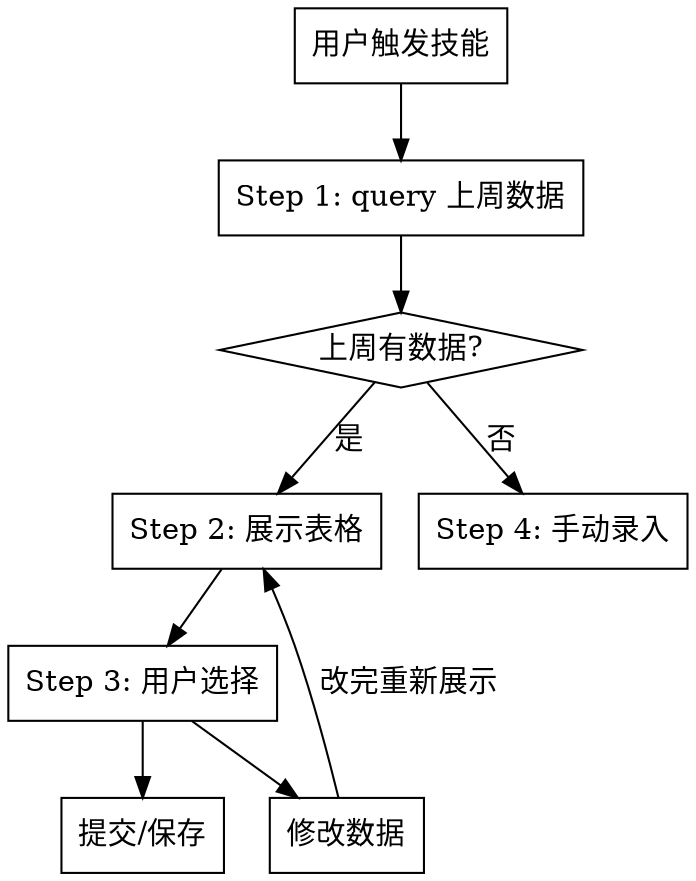

# 按周工时提报助手（TSM）

唤醒后自动查询上周数据，展示表格，用户一次选择即可完成提报。

## 主流程



### Step 1: 自动查询上周数据

触发技能后，**不问任何问题**，直接执行：

```bash
# 计算上周一的日期，设置为 TSM_WEEK_START
node <脚本绝对路径> query
```

脚本目录：`C:\Users\jinpeng.bai\.claude\skills\tsm-week-submission-assistant\tsm-weekly-api.mjs`

需设置环境变量 `TSM_WEEK_START` 为上周一日期（格式 `YYYY-MM-DD`）。

### Step 2: 格式化展示表格

将 `weeklyQuery` 返回的 `data` 数组格式化为表格：

```
上周工时 (2026-03-16 ~ 2026-03-20)

| 项目   | 周一 | 周二 | 周三 | 周四 | 周五 | 工作内容 |
|--------|------|------|------|------|------|----------|
| A项目  | 10%  | 20%  | 30%  | 40%  | 50%  | 开发需求 |
| B项目  | 90%  | 80%  | 70%  | 60%  | 50%  | 测试需求 |
```

**展示规则：**
- 日期表头：从 `dateList[].tsmTime` 取日期，格式化为 `MM-DD`（周一~周五）
- 工时值：`dateList[].reportHours`，带 `%` 后缀
- 同一日期多行合计须为 100%，尾部标注合计行

**如果某天合计不为 100%**，用 `⚠` 标记该列。

### Step 3: 用户选择操作

展示表格后，给出以下选项：

1. **直接提交本周** — 使用相同项目、相同工时比例、相同工作内容，提交本周
2. **仅保存草稿** — 数据写入本周但不提交
3. **修改数据** — 用户描述修改内容，改完重新展示确认

**用 AskUserQuestion 工具呈现选项**，让用户点选。

### Step 4: 执行

#### 选项 1（直接提交）或 选项 2（仅保存草稿）

基于上周数据构建 `tsm.config.json`，执行 `from-config`：

1. 取 `weeklyQuery` 返回的 `data` 数组
2. 将每行 `dateList` 中的日期替换为本周对应日期（上周一 → 本周一，以此类推）
3. 写入 `tsm.config.json`：
   ```json
   {
     "action": "save-multi",
     "week": { "start": "本周一YYYY-MM-DD", "weekdaysOnly": true },
     "saveMulti": {
       "rows": [
         {
           "projectName": "A项目",
           "jobContent": "开发需求",
           "hours": { "周一日期": 10, "周二日期": 20, ... }
         }
       ],
       "skipReport": false
     }
   }
   ```
   - 直接提交：`skipReport: false`（保存后自动提交）
   - 仅保存草稿：`skipReport: true`

4. 执行：
   ```bash
   node <脚本绝对路径> from-config
   ```

5. 反馈结果：HTTP 状态、业务 code、message

#### 选项 3（修改数据）

用户用自然语言描述修改，例如：
- 「把 A 项目工时改成 80,20,0,0,0」
- 「B 项目工作内容改成联调测试」
- 「删掉 B 项目」
- 「新增一行 C 项目 50,50,50,50,50 开发」

**处理规则：**
- 修改后重新生成表格展示
- 重新走 Step 3 让用户确认

### 无数据回退：手动录入

上周 `weeklyQuery` 返回 `data` 为空时：

```
上周 (YYYY-MM-DD ~ YYYY-MM-DD) 无工时记录。

请提供本周提报数据，格式参考：

项目名 | 周一 | 周二 | 周三 | 周四 | 周五 | 工作内容
```

用户一次性提供数据后，解析并走 Step 3 选择操作。

## 展示格式规范

### 标准表格

```
上周工时 (MM-DD ~ MM-DD)

| 序号 | 项目名称 | 周一(MM-DD) | 周二(MM-DD) | 周三(MM-DD) | 周四(MM-DD) | 周五(MM-DD) | 工作内容 |
|------|----------|-------------|-------------|-------------|-------------|-------------|----------|
| 1    | A项目    | 10%         | 20%         | 30%         | 40%         | 50%         | 开发需求 |
| 2    | B项目    | 90%         | 80%         | 70%         | 60%         | 50%         | 测试需求 |
|      | **合计** | **100%**    | **100%**    | **100%**    | **100%**    | **100%**    |          |
```

- 每日多行工时合计不为 100% 时，合计行标 `⚠`
- `reportHours` 为 0 或空时显示 `-`

### 操作选项呈现

使用 AskUserQuestion 工具：

| 选项 | 说明 |
|------|------|
| 直接提交本周 | 相同项目和工时比例提交到本周 |
| 仅保存草稿 | 写入本周但不提交审批 |
| 修改数据 | 调整项目、工时或内容后再操作 |

## 注意事项

- 每日各项目工时合计须为 100%，与前端表格校验一致
- 节假日/请假日不在 `tsmTimes` 中，以日历接口 `workHourQuery/count` 为准
- Token 过期时提示用户更新 `.env.tsm.local` 后重试

---

## 附录：技术参考

### 配置文件

- **鉴权**：`.env.tsm.local`（与脚本同目录，gitignore 已匹配）
  - `P_AUTH` / `P_RTOKEN`：访问令牌与刷新令牌
  - `TSM_API_BASE`：TSM 服务前缀
  - `VUE_APP_SSO`：SSO 网关
  - `VUE_APP_BASE_API_2`：用户服务前缀
- **业务参数**：`tsm.config.json`（参考 `tsm.config.example.json`）

### 执行方式

```bash
# 推荐方式
node <脚本绝对路径> from-config

# 查询指定周
TSM_WEEK_START=YYYY-MM-DD node <脚本绝对路径> query
```

脚本路径：`C:\Users\jinpeng.bai\.claude\skills\tsm-week-submission-assistant\tsm-weekly-api.mjs`

### 子命令一览

| 子命令 | 说明 |
|--------|------|
| `from-config` | 读 `tsm.config.json` 按 action 执行 |
| `query` | weeklyQuery 查询指定周数据 |
| `save-draft` | 单行满额保存草稿 |
| `save-multi [spec]` | 多行按日人天%保存 |
| `report-saved-week` | 对已保存周执行 weeklyReport |
| `week-dates` | 打印当周可填日 |
| `delete-week` | 删除指定周数据 |

### tsm.config.json 关键字段

```json
{
  "action": "query | save-multi",
  "week": { "start": "YYYY-MM-DD", "weekdaysOnly": true },
  "saveMulti": {
    "rows": [{ "projectName": "", "jobContent": "", "hours": { "YYYY-MM-DD": 50 } }],
    "skipReport": true
  }
}
```

### 接口路径（相对 `TSM_API_BASE`）

| 用途 | 路径 |
|------|------|
| 查询 | `workHour/weeklyQuery` |
| 保存 | `workHour/weeklySave` |
| 提交 | `workHour/weeklyReport` |
| 删除 | `workHour/batchDeleteByBids` |
| 查项目 | `workHour/findProjectByName` |
| 查审批人 | `workHourQuery/findChecker` |
| 日历 | `workHourQuery/count` |

### Token 过期处理

1. 响应含 `Token expired` → 提示用户更新 `.env.tsm.local` 中 `P_AUTH` / `P_RTOKEN`
2. 刷新失败 → 引导用户浏览器重新登录后重试
3. 不要在对话中粘贴 token
