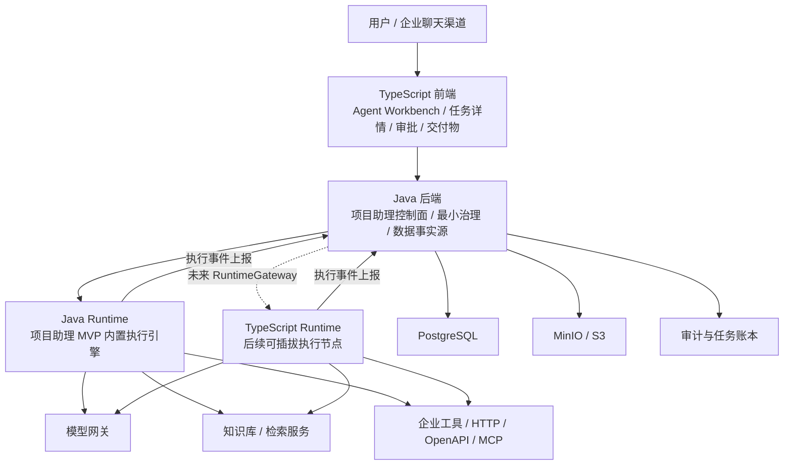

# 企业数字员工平台技术架构设计

> 版本：V1.0  
> 日期：2026-06-08  
> 输入文档：`docs/req/20260604_企业数字员工平台_需求.md`  
> 设计目标：当前阶段优先让项目助理 Agent 稳定、可观测、可恢复、可交付；平台化架构边界保留为后续演进基础，不作为当前产品交付主线。

## 1. 技术选型结论

本项目建议采用 **Java 主体系 + TypeScript 前端 + 可插拔 Runtime 架构预留 + Python 辅助工具** 的技术路线。

第一阶段 MVP 中，后端平台骨架、最小治理护栏和服务端 Runtime 均优先采用 Java 实现，降低团队学习成本和系统集成风险。当前所有平台化模块都应先服务于项目助理 Agent 的端到端闭环；未来当本地执行、MCP 工具生态、浏览器自动化、桌面端插件等能力成为明确需求时，再新增 TypeScript Runtime 作为独立执行节点接入。

| 层级 | 技术选型 | 阶段定位 |
|---|---|---|
| 平台后端 | Java / Spring Boot | 项目助理 Agent 的控制面、最小治理面和数据事实源 |
| 第一版 Runtime | Java Runtime | 面向项目助理场景的 MVP 内置执行引擎，快速打通端到端闭环 |
| 未来扩展 Runtime | TypeScript / Node.js | 后续本地执行、MCP、浏览器自动化、插件化工具 |
| 前端 | TypeScript + React | Agent Workbench、任务详情、审批交互、交付物预览和最小配置入口 |
| AI 实验工具 | Python | RAG 评测、Prompt 测试、文档处理实验 |
| 数据库 | PostgreSQL | 业务数据、任务账本、审计、配置、基础向量能力 |
| 缓存/队列 | Redis / MQ 可选 | 任务事件、异步通知、短期上下文、限流 |
| 文件存储 | MinIO / S3 兼容存储 | 文档、附件、导入文件、产物归档 |

## 2. 选型原则

### 2.1 Java 作为平台核心

企业数字员工平台的长期核心不是单次模型调用，而是企业级治理能力，包括租户隔离、用户身份、权限策略、动态审批、任务账本、审计追踪、模型网关、成本控制和企业系统集成。

当前阶段不把这些能力产品化为完整平台后台，而是沉淀为支撑项目助理 Agent 安全运行的最小护栏和事实源。结合当前团队以 Java 为主、现有系统大多为 Java 的现实情况，这些长期平台核心仍应沉淀在 Java 技术栈中。

### 2.2 Runtime 先内置，后插拔

MVP 阶段不建议过早拆分 Java 后端和 TypeScript Runtime。过早拆分会引入协议、状态同步、部署、监控和排障复杂度，影响第一阶段交付。

但第一版 Java Runtime 不能写死为本进程私有实现，应从接口层抽象为 Runtime 执行节点。这样未来接入 TypeScript Runtime 时，只需要新增 Runtime 实现，不需要推倒任务、审批、审计和前端展示链路。

### 2.3 Java 做事实源，Runtime 做执行器

无论 Runtime 是 Java 还是 TypeScript，平台数据事实源都必须在 Java 后端。

- Java 管任务状态。
- Java 管权限策略。
- Java 管审批流程。
- Java 管 Agent 配置。
- Java 管审计记录。
- Java 管成本预算。
- Runtime 执行任务、调用工具、生成事件、上报轨迹。

### 2.4 Python 不进入核心链路

Python 适合 AI 实验、离线评测、文档解析算法验证和 Prompt/RAG 测试集建设，但不建议进入核心在线链路。这样可以避免平台主链路出现第三套运行时和维护体系。

## 3. 总体架构



## 4. 核心分层设计

### 4.1 前端层

前端负责用户交互和过程可视化，不直接承担业务事实判断。

主要能力：

- Agent Workbench 对话入口。
- 任务运行状态和执行时间线展示。
- 项目助理执行计划、知识检索、工具动作和中间结果展示。
- 用户确认和审批交互。
- 交付物预览、复制和复用。
- 最小项目助理配置入口。
- 最小知识上传和检索调试入口。

完整 Agent 创建/发布/回滚管理、模型管理、工具注册、策略设计、审计后台、成本后台和租户管理不作为当前前端主线，后续在项目助理 Agent 质量稳定后再产品化。

前端只和 Java 后端交互。即使未来接入 TypeScript Runtime，也不建议前端直接依赖多个 Runtime 服务，避免事件源分散。

### 4.2 Java 平台后端

Java 后端是项目助理 Agent 的控制面、最小治理面和数据事实源。已有平台化模块作为支撑设施存在，但当前不把它们扩展为完整管理平台。

主要能力：

- 用户、组织、租户、角色和身份映射。
- Agent 配置、版本、发布、白名单和回滚。
- 任务账本、会话账本、运行记录。
- Dynamic Workflow 任务边界和执行约束。
- 权限策略、工具策略、审批策略。
- 动态审批、审批路由、审批恢复。
- 模型网关、模型授权、调用账本。
- 知识库管理、文档元数据、检索权限。
- 成本预算、token 上限、超限保护。
- 审计记录、敏感信息脱敏、数据保留。
- Runtime 注册、Runtime 调度和 Runtime 策略下发预留。

### 4.3 Java Runtime

第一阶段 Runtime 建议内置在 Java 后端进程中或作为同技术栈服务部署。它负责执行项目助理 Agent 的受控场景流程和 MVP 复杂任务闭环，不在当前阶段建设通用工作流平台或完整插件化 Runtime。

主要能力：

- 接收任务运行请求。
- 构建 Agent 上下文。
- 调用模型网关。
- 调用知识检索。
- 调用 HTTP/OpenAPI 或内置工具。
- 执行 Dynamic Workflow 步骤。
- 处理用户确认、审批挂起和恢复。
- 输出执行事件。
- 上报 token、工具调用、失败原因和最终结果。

Java Runtime 不直接绕过平台权限和审批。所有高风险动作必须回到 Java 平台策略服务判断。

### 4.4 TypeScript Runtime 预留

TypeScript Runtime 不在 MVP 强制建设，但架构上需要预留。

未来适用场景：

- MCP 工具生态接入。
- 本地文件、命令、浏览器自动化。
- 桌面端或本地 Runtime。
- 插件化工具市场。
- 前端/本地事件流高频联动。
- 半离线或企业内网执行节点。

TypeScript Runtime 的定位是执行器，不是新的业务事实源。

约束原则：

- 不保存长期 Agent 主配置。
- 不决定最终任务状态。
- 不独立执行高风险动作。
- 不长期持有模型密钥。
- 不绕过 Java 后端权限、审批、审计和成本控制。
- 关键事件必须上报 Java 后端。

## 5. Runtime 可插拔接口设计

第一版即使只有 Java Runtime，也需要按 RuntimeGateway 抽象。

### 5.1 RuntimeGateway

```java
public interface RuntimeGateway {
    RunStartResult startRun(RunStartCommand command);

    void cancelRun(RunCancelCommand command);

    void resumeRun(RunResumeCommand command);

    void submitUserInput(RunUserInputCommand command);

    void submitApprovalResult(RunApprovalResultCommand command);

    RuntimeEventStream streamEvents(String runId);
}
```

第一阶段实现：

```text
JavaInProcessRuntimeGateway
```

未来扩展实现：

```text
TypeScriptRemoteRuntimeGateway
EnterpriseRuntimeGateway
LocalRuntimeGateway
DedicatedTaskRuntimeGateway
```

### 5.2 统一运行请求

Runtime 启动任务时只能拿到执行快照，不直接读取和修改主配置。

关键字段：

| 字段 | 说明 |
|---|---|
| tenantId | 租户标识 |
| userId | 发起用户 |
| agentId | Agent 标识 |
| agentVersionId | Agent 版本 |
| taskId | 任务标识 |
| runId | 单次运行标识 |
| channel | 来源渠道 |
| input | 用户输入 |
| agentSnapshot | Agent 运行快照 |
| toolPolicySnapshot | 工具策略快照 |
| knowledgeScopeSnapshot | 知识范围快照 |
| budgetSnapshot | 预算快照 |
| traceId | 全链路追踪标识 |

### 5.3 统一执行事件

Runtime 通过事件上报执行过程，Java 后端负责落账本、审计和推送前端。

事件类型建议：

| 事件 | 说明 |
|---|---|
| RUN_STARTED | 运行开始 |
| PLAN_CREATED | 生成执行计划 |
| STEP_STARTED | 步骤开始 |
| STEP_COMPLETED | 步骤完成 |
| TOOL_CALL_REQUESTED | 准备调用工具 |
| TOOL_CALL_BLOCKED | 工具调用被策略拦截 |
| TOOL_CALL_COMPLETED | 工具调用完成 |
| KNOWLEDGE_RETRIEVED | 完成知识检索 |
| APPROVAL_REQUIRED | 需要审批 |
| RUN_SUSPENDED | 任务挂起 |
| RUN_RESUMED | 任务恢复 |
| USER_INPUT_REQUIRED | 需要用户补充信息 |
| TOKEN_USAGE_REPORTED | token 使用上报 |
| RUN_FAILED | 运行失败 |
| RUN_CANCELLED | 运行取消 |
| RUN_COMPLETED | 运行完成 |

每个事件必须带以下字段：

```text
tenantId
userId
agentId
taskId
runId
stepId
traceId
eventType
occurredAt
payload
```

## 6. 关键业务模块设计

### 6.1 Agent 配置与版本模块

职责：

- 一句话创建 Agent 草稿。
- 表单确认角色、职责、边界、知识、工具、权限、预算和发布范围。
- 生成 Agent 版本。
- 发布到白名单。
- 回滚到上一稳定版本。
- 生成 Runtime 执行快照。

MVP 不做完整 Agent 市场、多领域模板市场和复杂灰度发布。

### 6.2 任务账本模块

职责：

- 创建任务。
- 记录任务状态。
- 记录运行实例。
- 记录 Dynamic Workflow 步骤。
- 记录中间结果和最终交付物。
- 支持取消、挂起、恢复和失败重试。

任务状态以 Java 后端为准，Runtime 只上报事件，不直接成为状态事实源。

### 6.3 Dynamic Workflow 模块

Dynamic Workflow 是复杂任务的内部执行模式，不是流程画布，也不是大规模 Swarm。

MVP 支持：

- 明确目标、输入、约束和交付物。
- 拆分可追踪步骤。
- 限制步骤数、子任务数、执行时长和 token 上限。
- 展示中间结果。
- 允许用户确认、取消、补充信息。
- 支持失败降级、部分结果输出或转人工。

### 6.4 权限与审批模块

职责：

- 判断用户是否有权访问知识、工具和业务数据。
- 判断动作是否允许自动执行。
- 判断动作是否需要用户确认或业务审批。
- 按审批路由规则找到审批人。
- 审批通过后恢复任务。
- 审批拒绝或超时后给出替代路径。

MVP 审批路由：

1. 权限策略指定审批人。
2. 未指定时发送给企业管理员兜底。

后续扩展：

1. 资源所有者。
2. 业务负责人。
3. 组织架构领导。
4. 审批工作台和批量审批。

### 6.5 知识库模块

职责：

- 文档上传。
- 文档解析。
- 切块。
- 检索。
- 来源展示。
- 知识访问权限判断。
- 知识低可信或冲突提示。

MVP 建议使用 PostgreSQL + pgvector 或轻量向量检索能力打通链路。知识规模扩大后，再评估 OpenSearch、Milvus、Elasticsearch 等独立检索组件。

### 6.6 模型网关模块

职责：

- 模型供应商管理。
- 模型目录管理。
- 调用密钥管理。
- 模型授权范围。
- Chat / Embedding / Rerank 调用。
- token 统计。
- 成本账本。
- 熔断、限流和降级预留。

业务模块和 Runtime 不应直接散落调用第三方模型 API，应统一经过模型网关。

#### 6.6.1 OpenAI 兼容真实模型接入

模型调用仍通过 `ModelGateway` 统一入口进入。运行时和控制器不直接感知具体供应商；`RoutingModelGateway` 根据租户内 `ModelConfig.providerId` 读取 `ModelProvider.providerType`，再路由到具体适配器。

首批支持：

- `mock`：保留本地演示和测试行为。
- `openai_compatible`：通过 HTTP 调用 OpenAI 兼容 `/v1/chat/completions` 与 `/v1/embeddings`。

安全约束：

- API Key 仅从 `ModelProvider.authConfigJson` 读取并放入请求头。
- 调用日志只记录请求/响应摘要、token、状态、耗时和错误摘要，不记录 API Key。
- 自动化测试只使用本地 mock HTTP server，不调用外部模型服务。

### 6.7 审计模块

职责：

- 记录用户请求。
- 记录 Agent 决策说明。
- 记录工具调用。
- 记录知识访问。
- 记录审批过程。
- 记录失败原因。
- 记录模型调用摘要。
- 支持敏感信息脱敏和数据保留策略。

审计记录应服务于追溯和安全检查，不应暴露完整敏感上下文。

## 7. 部署架构

### 7.1 MVP 部署

```text
frontend
backend-java
postgresql
redis
minio
model-provider
```

MVP 中 Runtime 可作为 Java 后端内置模块部署，减少服务数量和排障复杂度。

### 7.2 后续部署

```text
frontend
backend-java
java-runtime-worker
typescript-runtime-worker
postgresql
redis
mq
minio
model-gateway
knowledge-worker
```

当 Runtime 变成独立执行节点后，需要增加：

- Runtime 注册。
- Runtime 心跳。
- Runtime 能力声明。
- Runtime 策略下发。
- Runtime 执行事件回传。
- Runtime 远程禁用。
- Runtime 审计上报。

## 8. 数据边界

### 8.1 Java 后端持久化数据

- 租户。
- 用户。
- 组织。
- 角色。
- Agent 配置和版本。
- Agent 发布范围。
- 任务账本。
- 会话账本。
- 审批记录。
- 审计记录。
- 工具配置。
- 知识库元数据。
- 模型调用账本。
- 成本预算。
- Runtime 注册信息。

### 8.2 Runtime 临时数据

- 单次运行上下文。
- 当前执行步骤。
- 临时工具调用结果。
- 流式输出缓存。
- 临时 token 统计。
- 本地执行快照。

Runtime 临时数据不能替代 Java 后端持久化账本。

## 9. 安全设计

### 9.1 基础安全原则

- 所有请求必须带租户上下文。
- 所有资源访问必须校验租户隔离。
- 高风险工具调用必须经过策略判断。
- 未知身份只能使用公开能力或引导绑定。
- Agent 不得通过对话改变自身权限、角色和系统边界。
- Runtime 不得绕过 Java 后端独立访问企业敏感资源。

### 9.2 Prompt 注入防护

MVP 阶段至少支持：

- 创建阶段安全红线拦截。
- 运行时输入安全校验。
- 文件、链接和知识内容中的注入风险识别。
- 工具调用前策略拦截。
- 关键动作审计。

后续阶段可增加：

- Prompt 安全分类器。
- 上下文隔离模板。
- 工具参数安全扫描。
- 高风险输出二次确认。
- 沙箱执行和录制回放。

## 10. 演进路线

### 10.1 第一阶段：Java MVP 闭环

目标：用 Java 技术栈打通项目助理 Agent 端到端执行闭环。

范围：

- Web Chat。
- 项目助理 Agent 最小配置。
- 会议纪要生成。
- 会议纪要转任务。
- 项目周报生成。
- 项目风险分析。
- Dynamic Workflow。
- 知识检索。
- HTTP/内置工具调用。
- 用户确认。
- 动态审批。
- 任务进度展示。
- 基础审计。
- token 上限和预算保护。

### 10.2 第二阶段：Runtime 解耦

目标：将 Java Runtime 从内置执行逐步抽象为可独立部署的 Runtime Worker。

范围：

- RuntimeGateway 稳定化。
- 运行事件协议稳定化。
- Runtime 注册表。
- Runtime 心跳。
- Runtime 能力声明。
- Runtime 调度策略。
- Java Runtime Worker 独立部署。

### 10.3 第三阶段：TypeScript Runtime 接入

目标：在不改变 Java 平台事实源的前提下，引入 TypeScript Runtime。

范围：

- MCP 工具接入。
- 浏览器自动化。
- 本地文件和命令工具。
- 桌面端或本地 Runtime。
- 插件化工具注册。
- Runtime 策略缓存。
- 高风险动作回 Java 校验。
- 执行事件统一上报。

### 10.4 第四阶段：平台化和生态化

目标：形成企业级数字员工平台能力。

范围：

- 多领域 Agent。
- Agent 模板市场。
- 工具市场。
- 完整审批工作台。
- 完整审计后台。
- 多维成本治理。
- 多 Agent 协作。
- 事件触发。
- 沙箱执行环境。
- 运行录制回放。

## 11. 主要风险与应对

| 风险 | 说明 | 应对 |
|---|---|---|
| MVP 范围过大 | 过早做完整平台会拖慢交付 | 第一阶段聚焦项目助理 Agent 执行闭环 |
| Runtime 后续难拆 | Java Runtime 如果强耦合业务方法，未来接 TS Runtime 成本高 | 第一版即定义 RuntimeGateway 和 RuntimeEvent |
| 状态不一致 | Java 和 Runtime 都维护任务状态会冲突 | Java 是唯一事实源，Runtime 只上报事件 |
| 权限绕过 | Runtime 直接调用工具可能越权 | 高风险动作必须回 Java 策略校验 |
| 审批恢复复杂 | 长任务挂起后无法准确恢复 | 任务账本记录 runId、stepId、checkpoint 和审批上下文 |
| 成本失控 | Dynamic Workflow 步骤过多或反复调用模型 | 限制步骤数、执行时长、token 和重试次数 |
| 技术栈分裂 | Java、TS、Python 同时进入主链路会增加维护成本 | Java 主链路，TS 后续执行器，Python 仅辅助 |

## 12. 测试建议

### 12.1 MVP 必测链路

- 项目知识问答能返回来源。
- 会议纪要能提取行动项和待确认项。
- 会议纪要转任务前能触发用户确认。
- 项目周报能进入 Dynamic Workflow 并展示步骤。
- 项目风险分析能生成依据、影响和建议。
- 权限不足时能发起审批并挂起任务。
- 审批通过后能恢复执行。
- 审批拒绝后能给出可理解失败原因。
- 用户取消任务后 Runtime 停止执行并记录状态。
- token 超限后能终止或降级。
- 工具调用失败后能记录失败环节。
- 审计记录能追踪用户、Agent、任务、工具和知识访问。

### 12.2 Runtime 可插拔测试

第一阶段即建议增加一个模拟 Runtime 实现，用于验证平台没有强依赖 Java 内置 Runtime。

测试点：

- 通过 RuntimeGateway 启动任务。
- 接收 RuntimeEvent。
- 根据事件更新任务账本。
- 前端通过 Java 后端看到统一事件流。
- 审批挂起后可恢复。
- Runtime 上报失败后任务状态正确变更。

## 13. 当前阶段落地建议

第一阶段不要直接建设 TypeScript Runtime，但必须按可插拔 Runtime 设计 Java 接口。

推荐落地顺序：

1. 建立 Java 平台模块边界。
2. 定义 RuntimeGateway、RunRequest、RuntimeEvent。
3. 实现 JavaInProcessRuntimeGateway。
4. 打通项目助理 Agent 样板链路。
5. 建立任务账本和审计记录。
6. 建立权限审批最小闭环。
7. 建立知识检索和模型网关最小能力。
8. 用模拟 Runtime 验证未来可拆分性。

最终原则：

```text
Java 管规则，Runtime 干活。
Java 定状态，Runtime 报事件。
Java 做事实源，Runtime 做执行器。
MVP 用 Java 跑通闭环，未来按需接入 TypeScript Runtime。
```

