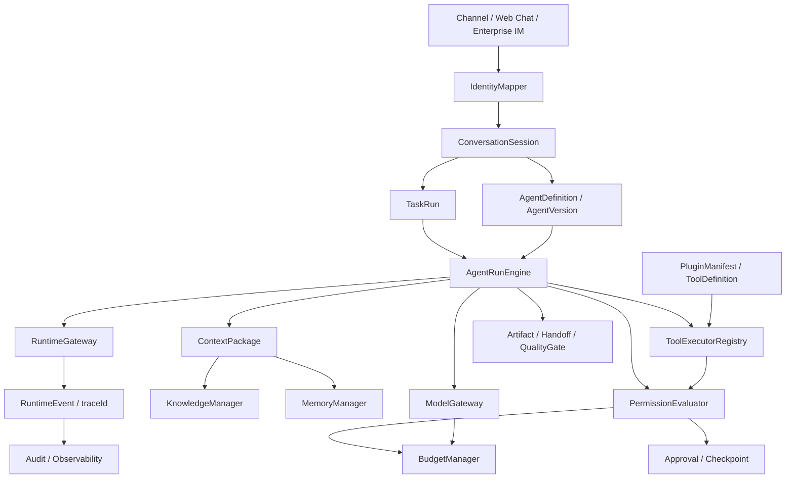
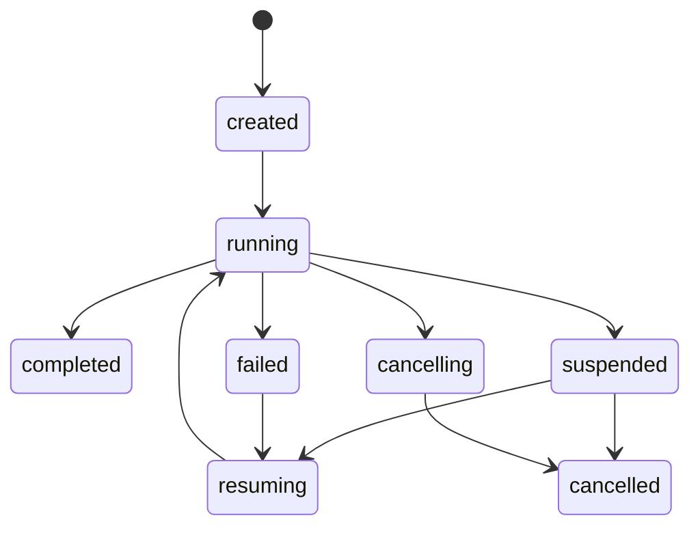

# Agent 总体设计方案

> 本文档是 Agent 后续设计、评审和开发的主依据。
> 设计基线：`docs/req/20260604_企业数字员工平台_需求.md`
> 技术基线：`docs/design/20260604_企业数字员工平台_技术.md`
> 评审输入：`docs/design/20260612_Agent总体设计方案_评审.md`

## 1. 设计目标与阶段边界

当前阶段不先建设完整平台后台，也不直接以“大规模多 Agent 敏捷团队”为第一闭环。第一阶段必须先把**项目助理 Agent MVP**做成可用、可靠、可解释、可恢复的端到端工作单元。

分阶段边界如下：

| 阶段 | 主场景 | 目标 |
|---|---|---|
| 第一阶段 | 项目助理 Agent MVP | 跑通会议纪要转任务、项目周报、项目风险分析、项目知识问答、确认/审批/失败恢复 |
| 第二阶段 | 业务系统 CLI / 插件化 Agent | 把现有系统能力封装成 CLI / HTTP / Java / MCP 工具，由 Agent 安全调用 |
| 第三阶段 | 完整敏捷开发团队 Agent | Product / Architect / Developer / QA / Delivery 多 Agent 协作完成研发闭环 |

系统核心链路调整为：

```text
Channel / User Identity
  -> ConversationSession
  -> AgentDefinition / AgentVersion
  -> AgentRunEngine
  -> ContextPackage
  -> Knowledge / Memory
  -> ModelGateway / ToolExecutor
  -> RuntimeEvent / RunStep / Artifact
  -> Approval / Permission / Budget / Audit
```

知识库、模型网关、审批、审计、成本、租户、渠道身份都是 Agent 可执行闭环的支撑能力。第一阶段只做最小护栏和事实源，不做完整平台化后台。

## 2. 与已有方案的关系

本文档不替代 `20260604_企业数字员工平台_技术.md`，而是在已有技术方案之上补充 Agent 层语义。

| 能力 | 已有技术方案 | 本设计处理 |
|---|---|---|
| RuntimeGateway | 技术方案 §5.1 已定义 `startRun` / `cancelRun` / `resumeRun` / `streamEvents` | 作为 AgentRunEngine 的下层执行接口 |
| RuntimeEvent | 技术方案 §5.3 已定义事件体系和 `traceId` | 作为 RunStep、用户进度、审计和回放的事实源 |
| ModelGateway | 技术方案 §6.6 已定义 OpenAI 兼容接入 | 扩展为 Agent 模型调用治理层 |
| 安全设计 | 技术方案 §9 已定义基础安全和 Prompt 注入防护 | 纳入 Governance 与运行时安全 |
| 项目助理 MVP | 需求文档 §5、§10、§12、§18 | 作为第一阶段主闭环 |

概念分工：

| 概念 | 定位 |
|---|---|
| AgentRunEngine | Agent 层编排入口，负责选择执行模式、构建上下文、推进步骤 |
| RuntimeGateway | 执行 Runtime 的统一接口，屏蔽 Java 本地 Runtime、远程 Runtime 和后续本地节点 |
| RuntimeEvent | 运行事实流，用于进度展示、审计、回放、恢复 |
| RunStep | Agent 内部步骤视图，来源于 RuntimeEvent 和任务状态 |
| ModelGateway | 所有模型调用的统一入口 |
| ToolExecutor | 所有外部动作的统一执行入口 |

## 3. 成熟 Agent 设计参考与取舍

本方案参考 Claude Code、Codex、OpenClaw，但按企业项目助理 MVP 做裁剪。

| 参考对象 | 可借鉴设计 | 本项目取舍 |
|---|---|---|
| Claude Code | `CLAUDE.md`、工具权限、MCP、hooks、subagents、memory | 借鉴分层配置、工具 allow / ask / deny、子 Agent 独立上下文；不照搬 coding-only 产品形态 |
| Codex | `AGENTS.md`、sandbox + approval、skills、plugins、MCP、hooks、memories、subagents | 借鉴项目规则、插件、审批和沙箱思路；多 Agent 默认显式触发 |
| OpenClaw | Gateway、Agent workspace、会话队列、技能优先级、上下文预算、多 Agent routing | 借鉴 Gateway 控制面、会话队列、Agent 独立工作区；企业场景默认最小权限 |

共性结论：

| 共性 | 设计结论 |
|---|---|
| Agent 不是 Prompt | Agent 是带角色、能力、上下文、记忆、工具、知识、权限和运行策略的受控执行主体 |
| Runtime 是核心 | 真正能力来自 `plan -> model/tool/knowledge -> observe -> persist -> continue` 的可恢复循环 |
| 工具是边界 | 文件、数据库、CLI、HTTP、MCP、业务系统都必须注册为 Tool 并受策略约束 |
| 知识不是普通工具 | 知识库需要权限、可信度、来源展示和低可信兜底 |
| 记忆不是规则 | 强制规则放 AgentDefinition、Policy、Hook；Memory 只做辅助召回 |
| 多 Agent 要隔离 | 子 Agent 有独立上下文、工具范围、预算和摘要输出 |

参考来源：

| 来源 | 参考点 |
|---|---|
| https://code.claude.com/docs/en/overview | Claude Code 工具、MCP、多形态入口 |
| https://code.claude.com/docs/en/memory | 指令文件与 memory 分离 |
| https://code.claude.com/docs/en/permissions | allow / ask / deny 权限模式 |
| https://code.claude.com/docs/en/sub-agents | 子 Agent 独立上下文和工具访问 |
| https://developers.openai.com/codex/concepts/customization | Codex `AGENTS.md`、skills、MCP |
| https://developers.openai.com/codex/agent-approvals-security | Codex sandbox 与 approval |
| https://developers.openai.com/codex/concepts/subagents | Codex 显式 subagent 工作流 |
| https://developers.openai.com/codex/hooks | hooks 生命周期扩展 |
| https://developers.openai.com/codex/memories | memory 边界和使用方式 |
| https://developers.openai.com/codex/plugins | plugins 打包能力 |
| https://github.com/openclaw/openclaw | OpenClaw Gateway、workspace、skills |
| https://docs.openclaw.ai/concepts/architecture | OpenClaw 架构 |
| https://docs.openclaw.ai/concepts/agent-loop | Agent loop |
| https://docs.openclaw.ai/concepts/context | Context 预算 |
| https://docs.openclaw.ai/concepts/memory | Memory |
| https://docs.openclaw.ai/concepts/multi-agent | Multi-agent |
| https://docs.openclaw.ai/gateway/security | Gateway 安全 |

## 4. 总体架构



核心模块职责：

| 模块 | 职责 |
|---|---|
| Channel / Identity | 渠道接入、用户身份映射、未知身份受限处理 |
| Agent Definition | 定义 Agent 是谁、能做什么、不能做什么、怎么运行 |
| Agent Runtime | 推进一次任务，负责计划、步骤、工具/模型/知识调用、恢复、完成 |
| RuntimeGateway | 统一执行接口，支持本地 Java Runtime 和未来远程 Runtime |
| Context | 为每一步构建可控上下文包 |
| Knowledge | 管理知识绑定、权限、可信度、来源展示和低可信兜底 |
| Memory | 管理工作记忆、会话摘要、确认后的长期记忆 |
| ModelGateway | 统一模型路由、调用、降级、流式输出、usage 和成本归集 |
| Tools / Plugins | 把外部业务系统、代码工作区、报表等能力暴露给 Agent |
| Permission / Approval | 统一权限评估、确认、审批、恢复 |
| Budget | Agent 日预算、单任务 token 上限、工具成本和超限保护 |
| Observability | trace、事件、日志、审计、回放和问题定位 |

## 5. Agent 生命周期与定义

### 5.1 AgentDefinition

Agent 不是一个简单 Prompt，而是一个受治理的执行主体。

| 字段 | 说明 |
|---|---|
| agentCode | Agent 唯一编码 |
| agentName | Agent 名称 |
| agentType | `project_assistant`、`specialist`、`team_orchestrator`、`business_operator` |
| description | 用途说明 |
| rolePrompt | 角色设定和行为风格 |
| responsibilityText | 职责范围 |
| boundaryText | 禁止事项和边界 |
| capabilityJson | 能力标签和能力参数 |
| toolPolicyJson | 可用工具、写操作策略、审批策略 |
| knowledgePolicyJson | 知识绑定、来源展示、可信度阈值 |
| contextPolicyJson | 上下文读取范围、摘要策略、最大上下文 |
| memoryPolicyJson | 记忆读取和写入策略 |
| orchestrationPolicyJson | 执行模式、Dynamic Workflow、多 Agent 策略 |
| modelPolicyJson | 模型路由、fallback、token 上限、流式策略 |
| budgetPolicyJson | Agent 日预算、单任务预算、超限策略 |
| channelPolicyJson | 可用渠道和消息能力 |
| configJson | 其他运行时和扩展配置 |

当前代码已开始落地：

| 对象 | 当前状态 |
|---|---|
| `Agent` | 已补充角色、能力、工具策略、上下文策略、记忆策略、编排策略字段 |
| `AgentVersion` | 已有角色 Prompt、职责、边界、工具范围、知识范围、权限策略、预算策略、运行快照 |
| `ExecutionMode` | 已有 `direct_tool`、`single_agent`、`dynamic_workflow`、`multi_agent` |
| `ContextPackage` | 已有一次运行的基础上下文包 |
| `AgentRunEngine` | 已有执行模式推断和 Runtime 入口薄抽象 |

### 5.2 Agent 生命周期

MVP 必须支持项目助理 Agent 的最小创建、配置和发布闭环。

```text
一句话创建
  -> 草稿生成
  -> 最小表单配置
  -> 沙箱测试
  -> 发布验证
  -> 白名单试用
  -> 版本发布
  -> 回滚 / 停用
```

创建方式：

| 方式 | 用途 | MVP 是否需要 |
|---|---|---|
| 一句话创建 | 用户描述“创建一个项目助理 Agent”后生成草稿 | 是 |
| 模板创建 | 从项目助理模板复制 | 是 |
| 空白创建 | 管理员手工配置 | 后续 |

项目助理默认模板至少包含：

| 模板项 | 默认内容 |
|---|---|
| 角色 | 项目助理，负责项目资料理解、会议纪要、任务拆解、周报和风险分析 |
| 职责 | 会议纪要转任务、项目周报、风险分析、项目知识问答、待确认事项整理 |
| 边界 | 不编造低可信知识、不越权访问资料、不直接执行高风险写操作 |
| 默认执行模式 | 简单任务 `single_agent`，复杂任务 `dynamic_workflow` |
| 默认知识策略 | 来源展示开启，低可信兜底开启 |
| 默认工具策略 | 只读工具默认允许，写操作确认或审批 |
| 默认预算 | 单任务 token 上限和 Agent 日预算使用租户默认值 |

一句话创建输出草稿：

| 草稿项 | 说明 |
|---|---|
| rolePrompt | 项目助理角色描述 |
| responsibilityText | 会议纪要、任务拆解、周报、风险分析、知识问答 |
| boundaryText | 不越权访问知识、不编造低可信答案、不直接执行高风险写操作 |
| recommendedTools | 推荐绑定的项目工具、任务工具、报告工具 |
| recommendedKnowledge | 推荐绑定的项目资料知识库 |
| budgetPolicy | 默认单任务 token 上限和日预算 |
| channelPolicy | Web Chat 和企业 IM 建议 |

发布验证清单：

| 检查项 | 规则 |
|---|---|
| 角色职责 | 不为空，不能和边界冲突 |
| 工具绑定 | 工具存在、schema 可用、风险级别明确 |
| 知识绑定 | 权限策略存在，来源展示规则明确 |
| 模型策略 | 有默认模型和 fallback 策略 |
| 预算配置 | 单任务上限和 Agent 日预算存在 |
| 渠道配置 | 至少 Web Chat 可用，企业 IM 按 MVP 配置 |
| 安全检查 | Prompt 注入红线、越权工具、高风险动作需要拦截 |
| 白名单 | MVP 只发布给指定试用用户 |

版本策略：

| 场景 | 处理 |
|---|---|
| 配置变更 | 生成新 `AgentVersion` |
| 运行中任务遇到版本更新 | 沿用启动时的 AgentVersion 快照 |
| 发布失败 | 不影响线上版本 |
| 回滚 | 切回上一已发布版本 |
| 停用 | 禁止新任务，已有任务按策略继续、暂停或取消 |

## 6. Agent Runtime 设计

### 6.1 Run Loop

```text
Receive Task
  -> Resolve identity / permission / budget
  -> Load AgentVersion snapshot
  -> Build ContextPackage
  -> Resolve ExecutionMode
  -> Plan / Dynamic Workflow
  -> Call ModelGateway / KnowledgeManager / ToolExecutor
  -> Observe result
  -> Emit RuntimeEvent
  -> Persist RunStep / Artifact / Checkpoint
  -> Write Memory if allowed
  -> Ask confirmation / approval if needed
  -> Continue, suspend, complete, cancel or fail
```

### 6.2 ExecutionMode

Dynamic Workflow 不是默认模式，也不是可视化流程画布。

| 模式 | 适用场景 | 示例 |
|---|---|---|
| `direct_tool` | 单工具、明确输入、低复杂度 | 查项目状态、查任务详情 |
| `single_agent` | 一个 Agent 可完成的多步骤任务 | 生成会议纪要、整理行动项 |
| `dynamic_workflow` | 项目助理复杂任务，需要拆解、检索、自检和汇总 | 项目周报、风险分析、跨资料整理 |
| `multi_agent` | 多角色协作 | 后续敏捷团队闭环 |

执行模式选择顺序：

1. 用户或任务显式指定。
2. AgentVersion 的 `orchestrationPolicy.executionMode` 指定。
3. 任务复杂度达到阈值，进入 `dynamic_workflow`。
4. 输入包含协作会话或多 Agent 策略，进入 `multi_agent`。
5. 只有明确 `toolId`，进入 `direct_tool`。
6. 其他默认 `single_agent`。

### 6.3 同步短任务与异步长任务

| 执行类型 | 适用模式 | 返回方式 | 恢复要求 |
|---|---|---|---|
| 同步短任务 | `direct_tool`、简单 `single_agent` | 直接返回结果 | 记录 RunStep 和日志 |
| 异步长任务 | `dynamic_workflow`、`multi_agent`、高成本任务 | 返回 `runId`，事件流推送进度 | 持久化 checkpoint，支持取消和恢复 |

长任务必须支持：

| 能力 | 设计 |
|---|---|
| 异步提交 | `AgentRunEngine.start` 调用 `RuntimeGateway.startRun` |
| 进度推送 | RuntimeEvent 通过 WebSocket / SSE / 轮询暴露 |
| 用户断连恢复 | 用户重新进入后按 `runId` 拉取执行时间线 |
| 超时管理 | 总任务超时、单步骤超时、审批等待超时分开配置 |
| Checkpoint | 持久化当前 step、上下文摘要、待恢复动作、审批单、traceId |

### 6.4 Dynamic Workflow

MVP 阶段 Dynamic Workflow 只服务项目助理复杂任务。

| 阶段 | 行为 |
|---|---|
| 目标理解 | 明确交付物、输入缺口、约束和风险 |
| 步骤规划 | 生成 3 到 8 个可追踪步骤，超过上限需请求确认 |
| 并行收集 | 允许知识检索、资料读取、项目状态查询并行 |
| 中间产物 | 每步产生 `Artifact` 或 `Observation` |
| 自检 | 检查来源、格式、缺失项、冲突和风险 |
| 汇总 | 输出最终交付物和依据 |
| 降级 | 超预算、超时、低可信时输出部分结果或请求用户确认 |

自检分两层执行：

| 自检层 | 方式 | 预算归属 |
|---|---|---|
| 规则自检 | schema 校验、必填字段、来源数量、权限标记、格式检查 | 不消耗模型 token，只记录运行耗时 |
| 模型自检 | 对复杂周报、风险分析、需求归纳做一致性、冲突和遗漏检查 | 计入当前 TaskRun token 预算，超过预算时降级为规则自检 |

默认先做规则自检；只有高价值、复杂或高风险交付物才触发模型自检。模型自检不能修改事实来源，只能提出缺口、冲突和建议。

项目助理 MVP 必须覆盖：

| 场景 | 输出 |
|---|---|
| 会议纪要转任务 | 行动项、责任人、截止时间、风险点、待确认事项 |
| 项目周报 | 本周进展、关键成果、延期阻塞、风险、下周计划 |
| 项目风险分析 | 风险描述、依据、影响范围、严重程度、建议动作 |
| 项目知识问答 | 答案、来源、可信度、低可信提示 |

边界控制：

| 控制项 | 默认策略 |
|---|---|
| 最大步骤数 | 8 |
| 最大并行子任务 | 3 |
| 单任务 token 上限 | 从 budgetPolicy 读取 |
| 最大执行时长 | 从 orchestrationPolicy 读取 |
| 重试次数 | 默认 1 次，工具可覆盖 |
| 超限行为 | 请求确认、输出部分结果或终止 |

### 6.5 RunStep 与状态机

RunStep 类型：

| 类型 | 说明 |
|---|---|
| `plan` | 生成计划 |
| `model_call` | 模型调用 |
| `knowledge_retrieve` | 知识检索 |
| `tool_call` | 工具调用 |
| `approval_wait` | 等待审批 |
| `user_input_wait` | 等待用户补充 |
| `handoff` | 多 Agent 交接 |
| `quality_gate` | 质量门禁 |
| `artifact` | 交付物生成 |
| `memory_write` | 记忆写入 |

核心对象状态机：



适用对象：`TaskRun`、`RunStep`、`AgentThread`。

`CollaborationSession` 状态：

```text
created -> planning -> executing -> completed
                         -> suspended -> resuming -> executing
                         -> failed
                         -> cancelled
```

禁止非法转换，例如 `completed -> running`。恢复只能从 `failed` 或 `suspended` 进入 `resuming`。

### 6.6 错误与失败恢复

| 失败类型 | 策略 | 用户可见输出 |
|---|---|---|
| 工具超时 | 按工具策略重试，超过次数后降级或转人工 | 哪个工具超时、已完成哪些步骤、可选下一步 |
| 工具业务错误 | 不盲目重试，解析业务错误码 | 业务失败原因和可修正输入 |
| 模型无效响应 | 重新约束输出格式后重试一次 | 仍失败则说明模型服务异常 |
| 审批拒绝 | 停止相关高风险动作，保留已完成部分 | 拒绝原因和影响范围 |
| 审批超时 | 等待、提醒、终止或转管理员 | 当前等待对象和超时时间 |
| 知识低可信 | 不编造，返回不确定性和缺口 | 缺少哪些来源或有哪些冲突 |
| 上下文超窗口 | 按裁剪优先级降级 | 标记部分历史被摘要 |
| 子 Agent 失败 | 局部重试、退回上游或转人工 | 失败角色、影响阶段、已完成交付物 |
| 用户取消 | 停止后续步骤，保留已完成 Artifact | 已执行动作和未执行动作 |

恢复策略优先级：

```text
retry same step
  -> reduce scope
  -> ask user confirmation
  -> produce partial result
  -> handoff to human/admin
  -> fail with explainable error
```

### 6.7 Artifact 最小模型

Artifact 是 Agent 运行过程和最终交付的结构化结果，不只是聊天文本。

| 字段 | 说明 |
|---|---|
| artifactId | 唯一标识 |
| artifactType | `meeting_action_items`、`weekly_report`、`risk_analysis`、`knowledge_answer`、`handoff`、`file` |
| taskRunId | 所属任务 |
| producerType | `agent`、`tool`、`user` |
| producerId | 生成者 |
| version | 版本号 |
| status | `draft`、`confirmed`、`superseded`、`archived` |
| contentJson | 结构化内容 |
| sourceRefs | 知识、工具、文件、会议纪要等来源引用 |
| confidence | 可信度，适用于知识或分析类 Artifact |
| sizeLimit | 大型文件只保存引用和摘要 |

Artifact 版本策略：

| 场景 | 处理 |
|---|---|
| Dynamic Workflow 中间结果 | 保存为 `draft`，可被后续步骤引用 |
| 用户确认后的任务草稿 | 标记为 `confirmed` |
| 后续步骤重写结果 | 新增版本，旧版本标记 `superseded` |
| Handoff | 必须引用具体 Artifact 版本 |

## 7. ModelGateway 设计

ModelGateway 是与 ToolExecutor 同级的一等能力，所有模型调用必须经过统一网关。

```java
public interface ModelGateway {
    ModelCallResult call(ModelCallCommand command);

    ModelStream stream(ModelCallCommand command);
}
```

核心职责：

| 职责 | 说明 |
|---|---|
| 模型路由 | 按 Agent 配置、任务类型、租户授权、预算、模型可用性选择模型 |
| Provider 适配 | 统一封装 OpenAI compatible、Anthropic、本地模型和后续私有模型 |
| Prompt 分层 | 系统提示、Agent 规则、工具 schema、知识 evidence、用户输入分层拼装 |
| Token 预算 | 模型调用前估算，调用后按 usage 归集 |
| 降级容错 | 主模型不可用时按 fallback 链降级，降级后标记输出可信度 |
| 流式输出 | SSE / WebSocket 事件由 RuntimeEvent 承载，支持断连后查询历史事件 |
| 成本归集 | 按 tenantId、agentId、taskRunId、modelProvider、modelName 归集 |
| 日志审计 | 保存 prompt 摘要、模型响应摘要、usage、错误码和 traceId |

模型路由顺序：

```text
Agent modelPolicy
  -> tenant authorized providers
  -> task type requirement
  -> budget remaining
  -> provider health
  -> fallback chain
```

调用前检查：

| 检查项 | 行为 |
|---|---|
| 租户是否授权模型 | 未授权直接拒绝 |
| Agent 是否允许该模型 | 未绑定则 fallback 或拒绝 |
| token 预算是否足够 | 不足则降级、缩短上下文或请求确认 |
| Prompt 安全扫描 | 高风险注入或敏感外发风险时拦截 |

日志要求：

| 字段 | 说明 |
|---|---|
| traceId | 全链路追踪 |
| taskRunId | 任务运行 |
| agentVersionId | Agent 快照 |
| provider / model | 实际调用模型 |
| promptHash / promptSummary | 不保存敏感明文 |
| completionSummary | 响应摘要 |
| inputTokens / outputTokens | usage |
| costEstimate | 成本估算 |
| status / errorCode | 成功或失败原因 |

流式恢复策略：

| 场景 | 处理 |
|---|---|
| 客户端断连 | Runtime 继续执行，RuntimeEvent 持久化 |
| 客户端重连 | 客户端携带 `runId` 和 `lastEventId` 拉取遗漏事件 |
| 服务端中断 | 从最近 checkpoint 恢复；已发送但未持久化的片段不作为事实 |
| 模型流中断 | 当前 `model_call` 标记 failed，可按错误恢复策略重试或降级 |

`lastEventId` 使用 RuntimeEvent 的单调递增序号，不依赖前端本地时间。

## 8. Context 与 Knowledge 设计

### 8.1 ContextPackage

ContextPackage 是每一步执行前的统一上下文包，不等于把所有历史塞给模型。

| 上下文 | 来源 | 用途 |
|---|---|---|
| User Context | 用户、租户、渠道、权限 | 权限判断、个性化、审计 |
| Agent Context | AgentDefinition、AgentVersion | 行为边界、工具范围、模型策略 |
| Task Context | TaskRun、RunStep | 当前目标和执行状态 |
| Session Context | 对话会话、历史摘要 | 理解连续对话 |
| Knowledge Context | 知识 evidence、来源、可信度 | 项目问答和交付物依据 |
| Artifact Context | 已生成交付物、上游交接物 | 继续加工或交付 |
| Tool Context | 工具定义、schema、调用结果摘要 | 选择和调用工具 |
| Memory Context | 相关记忆 | 个性化和长期约束 |
| Policy Context | 权限、审批、成本、风险 | 安全执行 |

裁剪优先级：

| 优先级 | 内容 | 处理 |
|---|---|---|
| 1 | Agent 角色、边界、工具/知识/权限策略 | 不裁剪，只能压缩表达 |
| 2 | 当前任务目标和用户最新输入 | 不裁剪 |
| 3 | 当前步骤必需工具 schema 和知识 evidence | 只保留相关项 |
| 4 | 当前 TaskRun 中间结果和 Artifact 摘要 | 可摘要 |
| 5 | 会话历史摘要 | 可进一步摘要 |
| 6 | Memory | 按相关性裁剪 |
| 7 | 大型 Tool 输出原文 | 不直接注入，保留日志和摘要 |

### 8.2 Knowledge 是一等能力

知识检索可通过 Tool 执行，但 Knowledge 不是普通工具。它需要独立的绑定、权限、可信度和来源展示。

新增对象：

| 对象 | 职责 |
|---|---|
| KnowledgeBinding | Agent 与知识库绑定，配置用途、范围、来源展示 |
| KnowledgePolicy | 用户权限、Agent 权限、租户边界、可信度阈值 |
| KnowledgeEvidence | 片段内容、来源、文档、更新时间、权限标记 |
| KnowledgeConfidence | `high`、`medium`、`low`、`conflicting`、`insufficient` |

知识检索流程：

```text
Resolve knowledge bindings
  -> Check user/resource permission
  -> Retrieve evidence
  -> Evaluate confidence
  -> Inject evidence into ContextPackage
  -> Require source display when answer uses evidence
  -> Low confidence fallback when evidence is weak/conflicting
```

低可信处理：

| 可信状态 | 行为 |
|---|---|
| high | 正常回答并展示来源 |
| medium | 回答并提示依据有限 |
| low | 不给确定结论，列出缺口 |
| conflicting | 展示冲突来源，要求用户确认 |
| insufficient | 明确未找到可靠依据 |

来源展示格式：

| 字段 | 说明 |
|---|---|
| title | 文档或资料标题 |
| sourceType | 知识库、附件、任务系统、会议纪要 |
| updatedAt | 来源更新时间 |
| snippet | 依据摘要 |
| confidence | 可信等级 |
| accessChecked | 是否完成用户权限校验 |

## 9. Memory 设计

Memory 是辅助召回，不是知识库、不是强制规则、不是权限系统。

| 类型 | 生命周期 | 用途 | 存储建议 |
|---|---|---|---|
| Working Memory | 单次 Run | 当前步骤状态、中间变量 | RunStep / RuntimeCheckpoint |
| Session Memory | 单个会话 | 用户已确认信息、会话摘要 | ConversationSession / summary |
| Task Memory | 单个任务 | 任务目标、约束、决策记录 | TaskRun / Artifact |
| Agent Memory | 某个 Agent 长期 | Agent 偏好、常用规则 | AgentMemory |
| Domain Memory | 某业务域长期 | 报表口径、业务规则、项目约束 | DomainMemory |
| User Memory | 某用户长期 | 用户偏好、常用格式 | UserMemory |

第一阶段只做：

1. Working Memory：复用 RuntimeCheckpoint 和 RunStep。
2. Session Memory：保存会话摘要。
3. Domain / Agent Memory：只支持人工确认后写入。

Memory 检索策略：

```text
scope filter
  -> permission filter
  -> memoryType filter
  -> recency / relevance score
  -> sensitivity filter
  -> topK inject into ContextPackage
```

| 排序因素 | 说明 |
|---|---|
| scope | tenant / user / agent / domain 必须匹配 |
| permission | 当前用户和 Agent 都有权读取 |
| relevance | 与当前任务、项目、工具、知识主题的相似度 |
| recency | 最近确认或最近使用的记忆优先 |
| confidence | 人工确认的长期记忆优先于自动摘要 |

第一阶段不做跨租户、跨业务域的全局记忆召回。

长期记忆写入链路：

```text
Runtime detects memory candidate
  -> classify type / scope / sensitivity
  -> attach source evidence
  -> require user/admin confirmation when needed
  -> persist as versioned memory
  -> future retrieval uses scope + permission + relevance
```

禁止写入长期记忆：

| 场景 | 处理 |
|---|---|
| 敏感数据 | 禁止 |
| 工具返回的临时数据 | 默认禁止 |
| 低可信知识结论 | 禁止 |
| 跨租户信息 | 禁止 |
| 未确认业务规则 | 禁止 |

## 10. Tools / Plugins 设计

### 10.1 Tool 是外部动作边界

Agent 不直接访问数据库、文件系统或业务系统。所有外部动作都通过 Tool 完成。

| 类型 | 说明 |
|---|---|
| `builtin` | 平台内置工具 |
| `cli` | 调用现有系统 CLI |
| `http` | 调用业务系统 HTTP API |
| `java` | 调用平台内部 Java 服务 |
| `mcp` | 后续接 MCP 工具 |
| `workspace` | 代码搜索、测试、构建、补丁生成 |

Tool 运行分层：

| 层次 | 内容 | 说明 |
|---|---|---|
| Tool Definition | 名称、描述、输入输出 schema、风险级别、幂等性 | 给模型选择工具，也给 Runtime 校验 |
| Tool Binding | Agent / Plugin / Tenant 绑定关系 | 决定 Agent 是否能看到该工具 |
| Tool Policy | allow / ask / deny、次数、预算、dry-run、审批 | 决定一次调用是否可执行 |
| Tool Executor | CLI / HTTP / Java / MCP / Workspace 执行器 | 真正执行，记录日志，返回 observation |
| Tool Hook | PreToolUse / PostToolUse / PermissionRequest | 做敏感检查、审计、二次校验 |

### 10.2 ToolExecutor

```java
public interface ToolExecutor {
    String toolType();

    ToolExecutionResult execute(ToolExecutionContext context);
}
```

执行器类型：

| 执行器 | 用途 |
|---|---|
| BuiltinToolExecutor | 内置工具 |
| CliToolExecutor | 调业务系统 CLI |
| HttpToolExecutor | 调 HTTP API |
| JavaBeanToolExecutor | 调内部 Java 服务 |
| McpToolExecutor | 调 MCP Server |

工具调用链路：

```text
Agent proposes tool call
  -> Validate tool binding
  -> Validate input schema
  -> PermissionCheck(actor, action, resource, context)
  -> Evaluate budget and risk
  -> If approval required, create approval and checkpoint
  -> Execute through ToolExecutor
  -> Validate output schema
  -> Normalize result
  -> Write ToolCallLog and RuntimeEvent
  -> Return observation to Runtime
```

### 10.3 工具发现与匹配

```text
intent
  -> capabilityTags filter
  -> Agent binding filter
  -> user/resource permission filter
  -> risk and approval filter
  -> schema fit score
  -> choose tool or ask user
```

`intent` 来源：

| 来源 | 说明 |
|---|---|
| 用户输入解析 | 模型或规则从用户输入中提取动作、对象、约束和业务域 |
| Agent 能力画像 | `capabilityJson` 提供候选能力标签 |
| 当前步骤计划 | Dynamic Workflow 的 stepType 和 expectedOutput 约束工具类型 |
| 上下文证据 | 已检索知识、Artifact、历史步骤可补充业务对象 |

MVP 默认由模型生成结构化 intent，再由 Runtime 用规则做二次校验。模型只负责提出候选 intent，不能绕过 Tool Binding、PermissionCheck 和 ToolPolicy。

若多个工具匹配且风险不同，优先选择只读、低风险、来源可信的工具；无法判断时向用户确认。

### 10.4 CLI 工具安全与幂等

CLI 工具必须是“注册命令 + 参数模板 + JSON schema”，禁止 Agent 拼接任意 shell。

```json
{
  "command": "customer-cli",
  "allowedSubcommands": ["query", "create", "update-contact"],
  "argsTemplate": ["{{subcommand}}", "--payload-json", "{{payloadFile}}"],
  "stdinSchema": {
    "type": "object"
  },
  "sideEffect": "declared_by_tool",
  "requiresApprovalWhen": ["write", "highRisk", "crossTenant"]
}
```

幂等 key 规则：

```text
idempotencyKey = hash(tenantId + agentId + taskRunId + toolCode + normalizedInput + businessKey)
```

| 项 | 策略 |
|---|---|
| 存储时效 | 读操作不存，写操作默认保留 7 天，可按工具配置 |
| 冲突处理 | 同 key 同输入返回历史结果，同 key 不同输入拒绝执行 |
| 用户取消 | 已执行写操作不能静默回滚，必须展示已完成影响 |

### 10.5 PluginManifest

Plugin 是一组工具、权限、配置、文档和自检能力的打包单位。

| 内容 | 说明 |
|---|---|
| tools | 可注册的工具定义 |
| executors | CLI / HTTP / Java / MCP 执行配置 |
| skills | 可复用任务说明和操作步骤，后续新增 |
| hooks | 工具调用前后、审批、会话开始/结束的扩展点，后续新增 |
| auth | 凭据引用、scope、租户绑定 |
| docs | 给 Agent 阅读的业务说明、报表口径、常见问题 |
| tests | 插件自检命令和契约测试 |

加载优先级：

| 优先级 | 来源 | 用途 |
|---|---|---|
| 1 | 系统托管插件 | 平台内置、安全审计过的能力 |
| 2 | 租户托管插件 | 企业管理员发布的业务系统能力 |
| 3 | 项目插件 | 某项目专用工具和规则 |
| 4 | Agent 私有插件 | 某专用 Agent 的实验能力 |

第一阶段只做本地 manifest + 管理员注册，不开放插件市场和自动安装。

## 11. 多 Agent 协作设计

多 Agent 是第三阶段完整敏捷开发团队的核心，不作为项目助理 MVP 的必需闭环。

核心对象：

| 对象 | 说明 |
|---|---|
| CollaborationSession | 一次多 Agent 协作 |
| CollaborationPlan | 协作计划，包含阶段、角色、输入输出、门禁 |
| AgentThread | 某个 Agent 在协作中的独立执行线程 |
| AgentHandoff | Agent 之间的交付物传递 |
| QualityGate | 阶段质量门禁 |
| CollaborationStrategy | 编排策略 |

敏捷团队协作流：

```text
Requirement
  -> Orchestrator creates CollaborationPlan
  -> Product Agent produces PRD / User Stories / Acceptance Criteria
  -> Architect Agent produces Technical Design
  -> Developer Agent produces Patch / Implementation Notes
  -> QA Agent produces Test Plan / Test Result
  -> QualityGate validates artifacts
  -> Delivery Agent summarizes final package
```

必须补反馈回路：

| QualityGate 结果 | 行为 |
|---|---|
| pass | 进入下一阶段 |
| rework | 退回指定 AgentThread 并附带原因 |
| escalate | 转人工或管理员确认 |
| fail | 终止协作并输出已完成部分 |

CollaborationPlan 增加策略：

| 字段 | 说明 |
|---|---|
| reworkPolicy | 最大重做次数、退回条件、升级策略 |
| failurePolicy | 子线程失败后的局部重试、跳过、终止或转人工 |
| concurrencyPolicy | 哪些阶段可并行，哪些资源需要锁 |

Handoff 增加字段：

```json
{
  "fromThreadId": 1,
  "toThreadId": 2,
  "artifactType": "prd",
  "artifactId": 100,
  "summary": "已完成用户故事和验收标准",
  "requiredAction": "基于 PRD 输出技术方案",
  "reworkFromThreadId": null,
  "reworkReason": null,
  "constraints": ["不得改变 MVP 范围"]
}
```

## 12. 用户交互与渠道身份

Agent 输出必须是后端结构化消息，前端和渠道只负责渲染。

消息类型：

| 类型 | 用途 |
|---|---|
| `text` | 普通回答 |
| `card` | 结构化结果，如任务草稿、风险卡片 |
| `confirmation` | 用户确认或取消 |
| `approval_wait` | 等待审批 |
| `progress` | 长任务进度 |
| `file` | 报告、纪要、导出物 |
| `feedback_request` | 点赞、点踩、评分和文字反馈 |
| `error` | 失败原因、影响范围、可选下一步 |

错误展示结构：

```json
{
  "reason": "审批被拒绝",
  "impact": "无法创建外部系统任务，已保留会议纪要和行动项草稿",
  "nextActions": ["修改后重试", "转人工处理", "仅导出草稿"]
}
```

进度展示模型：

| 字段 | 说明 |
|---|---|
| currentStage | 当前阶段 |
| completedStages | 已完成阶段 |
| waitingOn | 等待用户、审批人、外部系统或工具 |
| nextStep | 下一步 |
| partialArtifacts | 已生成的中间交付物 |

Channel 抽象：

| 字段 | 说明 |
|---|---|
| channelType | `web_chat`、`enterprise_im`、`open_api` |
| identityMapping | 渠道用户 ID 到平台用户的映射规则 |
| messageCapability | 支持的消息类型和交互能力 |
| fallbackPolicy | 渠道不支持复杂交互时的降级方式 |

身份策略：

| 状态 | 权限 |
|---|---|
| 已识别平台用户 | 按用户、Agent、资源三层权限执行 |
| 未绑定企业用户 | 只允许公开能力，引导绑定 |
| 群聊用户 | 涉及敏感信息时转私聊或 Web 页面 |
| 跨渠道同用户 | 会话、记忆、审计、成本统一归属平台 userId |

## 13. Governance 与安全

### 13.1 统一权限评估

权限判断统一走：

```text
PermissionCheck(actor, action, resource, context) -> allow / deny / ask
```

| 输入 | 说明 |
|---|---|
| actor | 用户、Agent、AgentThread、渠道身份 |
| action | 读取知识、调用工具、写业务系统、外发消息、模型调用 |
| resource | 知识、工具、数据、文件、渠道、模型 |
| context | 租户、任务、风险等级、预算、审批状态 |

各 policy JSON 是权限评估输入，不是各自独立的权限系统。

权限三层：

| 层 | 说明 |
|---|---|
| 用户权限 | 这个人能访问什么 |
| Agent 权限 | 这个 Agent 能做什么 |
| 资源权限 | 这个知识、工具、数据谁能用 |

### 13.2 审批路由

审批路由顺序：

1. 工具或资源策略指定审批人。
2. 资源所有者。
3. 业务负责人。
4. 租户管理员兜底。

审批结果处理：

| 结果 | 行为 |
|---|---|
| 通过 | 从 checkpoint 恢复执行 |
| 拒绝 | 停止对应动作，展示拒绝原因和影响 |
| 超时 | 按策略提醒、继续等待、终止或升级 |
| 撤回 | 停止等待并标记取消 |

### 13.3 运行时安全与 Prompt 注入防护

| 风险来源 | 防护 |
|---|---|
| 用户输入 | 用不可信标签包裹，禁止覆盖系统规则 |
| Tool 输出 | 标记为 observation，不作为指令执行 |
| Knowledge 文档 | 标记为 evidence，不允许改变 Agent 边界 |
| Handoff | 校验来源 Agent、artifact 类型和权限 |
| 文件/URL 内容 | 进入模型前做注入风险扫描 |

Runtime 要求：

```text
每轮模型调用前重新注入 Agent 角色、边界和工具策略。
外部内容只能作为数据，不得作为系统指令。
高风险工具调用前必须二次确认或审批。
```

### 13.4 成本控制

预算检查点：

| 检查点 | 行为 |
|---|---|
| Run 创建前 | 检查 Agent 日预算、任务预算、用户权限 |
| ModelCall 前 | 估算 prompt token 和最大输出 token |
| ToolCall 前 | 检查工具成本和高风险确认 |
| RunStep 完成后 | 按 usage 或估算扣减 |
| 超限时 | 拒绝新步骤、输出部分结果或请求管理员确认 |

MVP 策略：

| 项 | 策略 |
|---|---|
| 预算周期 | 租户时区自然日 |
| token 统计 | 模型返回 usage 为主，调用前估算为辅 |
| 工具成本 | 按工具配置估算 |
| 超限行为 | 停止新步骤，输出已完成结果和原因 |
| 高成本任务 | 执行前提示并请求确认 |

### 13.5 数据隐私与生命周期

| 数据类型 | 处理 |
|---|---|
| 对话数据 | 按租户保留策略保存 |
| 任务数据 | 与 TaskRun 生命周期绑定 |
| 审批数据 | 长于任务保留，用于审计 |
| 工具调用记录 | 参数和结果摘要脱敏 |
| 知识访问记录 | 保存来源和权限判断 |
| 反馈数据 | 用于运营和测试集建设 |
| 记忆数据 | 支持用户/管理员查看、禁用、删除 |

敏感信息进入模型前必须脱敏；审计日志不保存密钥、密码、身份证号、薪资等明文。

## 14. 可观测性与审计

统一 `traceId` 贯穿：

```text
ConversationSession
  -> TaskRun
  -> AgentThread
  -> RunStep
  -> ModelCallLog
  -> ToolCallLog
  -> ApprovalRequest
  -> Artifact
```

用户可见执行时间线：

| 时间线项 | 来源 |
|---|---|
| 已理解目标 | plan step |
| 正在检索资料 | knowledge/tool step |
| 等待用户确认 | checkpoint |
| 等待审批 | approval event |
| 已生成中间结果 | artifact event |
| 失败或取消 | error/cancel event |

运行回放最小数据集：

| 数据 | 要求 |
|---|---|
| AgentVersion 快照 | 必须保存 |
| ContextPackage 摘要 | 必须保存，敏感内容脱敏 |
| Prompt 摘要 | 保存 hash 和摘要 |
| Tool input/output 摘要 | 保存结构化摘要和错误 |
| RuntimeEvent | 全量保存 |
| Artifact | 保存版本 |

监控指标：

| 指标 | 用途 |
|---|---|
| run duration | 长任务耗时 |
| step duration | 卡点定位 |
| model error rate | 模型可用性 |
| tool error rate | 工具稳定性 |
| approval wait time | 审批瓶颈 |
| budget usage | 成本控制 |
| low confidence rate | 知识质量 |

## 15. MVP 场景落地路径

### 15.1 项目助理 Agent MVP

```text
用户输入项目目标 / 资料 / 会议纪要
  -> 身份映射和权限校验
  -> 判断任务复杂度
  -> 简单任务 direct answer
  -> 中等任务 single_agent + knowledge/tool
  -> 复杂任务 dynamic_workflow
  -> 生成结构化交付物
  -> 展示来源、进度、错误和确认项
  -> 收集反馈
```

MVP 必做能力：

| 能力 | 设计支撑 |
|---|---|
| 会议纪要转任务 | Dynamic Workflow、Artifact、confirmation |
| 项目周报生成 | Knowledge evidence、Tool 查询、Artifact |
| 项目风险分析 | Dynamic Workflow、自检、低可信兜底 |
| 项目知识问答 | KnowledgePolicy、来源展示、可信度 |
| 用户确认与取消 | Checkpoint、用户消息协议 |
| 动态审批 | PermissionCheck、Approval、resumeRun |
| 任务过程可见 | RuntimeEvent、执行时间线 |
| 错误展示 | error message model |
| 反馈收集 | feedback_request |
| 成本控制 | BudgetManager |
| 渠道身份 | Channel、IdentityMapper |

### 15.2 业务系统 CLI / 插件化 Agent

第二阶段目标：

| Agent | 能力 |
|---|---|
| 查询 Agent | 调 CLI / HTTP 查询业务数据 |
| 数据维护 Agent | 添加或修改数据，写操作审批 |
| 报表 Agent | 查询多系统数据并生成报表 |
| 业务流程 Agent | 按业务规则串联多个工具 |

必要能力：

1. `direct_tool` 和 `single_agent` 执行模式。
2. CliToolExecutor。
3. Tool schema 校验。
4. 写操作审批和恢复。
5. PluginManifest 注册工具集合。
6. 幂等 key 和冲突处理。

### 15.3 完整敏捷开发团队 Agent

第三阶段目标：

| 阶段 | 输出 |
|---|---|
| Orchestrator | 协作计划 |
| Product Agent | PRD、用户故事、验收标准 |
| Architect Agent | 技术方案、模块拆分、风险 |
| Developer Agent | 代码补丁或实现说明 |
| QA Agent | 测试用例、测试结果、风险 |
| Delivery Agent | 最终交付包 |

必要能力：

1. `multi_agent` 执行模式。
2. CollaborationStrategy 真正驱动 AgentThread 执行。
3. Handoff 作为下游 Context 输入。
4. QualityGate 支持 pass / rework / escalate / fail。
5. workspace 工具作为插件接入。
6. 子 Agent 失败传播和局部恢复。

## 16. 实施顺序

### 16.1 进入实现前必须完成

| 顺序 | 任务 | 目的 |
|---|---|---|
| 1 | 明确 RuntimeGateway / RuntimeEvent / ModelGateway 继承关系 | 避免两套抽象 |
| 2 | 补 ModelGateway 最小实现设计 | Agent 可真实调用模型并归集成本 |
| 3 | 补 Runtime 长时任务和状态机 | 支持可恢复、可取消、可追踪任务 |
| 4 | 补错误恢复和用户可见错误 | 失败后可解释、可继续 |
| 5 | 提升 Knowledge 为一等能力 | 支撑项目助理知识问答和低可信兜底 |
| 6 | 补项目助理 MVP Dynamic Workflow | 覆盖会议纪要、周报、风险分析 |

### 16.2 可与实现并行

| 顺序 | 任务 | 目的 |
|---|---|---|
| 7 | Agent 生命周期管理 | 一句话创建、发布验证、白名单 |
| 8 | ToolExecutor 和 PluginManifest | 支撑业务 CLI 场景 |
| 9 | Channel 和 IdentityMapper | 支撑 Web Chat 和企业 IM |
| 10 | PermissionEvaluator 和 Approval | 统一权限与审批 |
| 11 | BudgetManager | 成本上限和超限保护 |
| 12 | Observability | trace、进度、回放、审计 |
| 13 | 多 Agent CollaborationStrategy | 支撑敏捷团队场景 |

## 17. 当前不做

| 不做 | 原因 |
|---|---|
| 完整管理后台 | 会分散项目助理 MVP 主线 |
| 完整插件市场 | 先做本地 manifest 和管理员注册 |
| 可视化工作流画布 | Dynamic Workflow 是内部执行模式 |
| 大规模 Swarm | 成本和责任链不可控 |
| 完整 FinOps 平台 | MVP 只做预算上限和基础统计 |
| 全渠道同时接入 | MVP 只做 Web Chat 和一个企业聊天渠道 |
| 自动 Agent 发现市场 | MVP 由管理员预配置 |
| 事件触发 Agent | MVP 阶段只做用户主动触发，事件驱动后续建设 |
| 完整沙箱执行环境 | MVP 先做工具调用基础隔离、白名单、审批和审计，完整沙箱后续建设 |

## 18. 可选技术验证

以下能力不作为第一阶段产品验收口径，但可以作为技术验证穿插进行。

| 验证项 | 目的 | 边界 |
|---|---|---|
| 多 Agent 最小 Demo | 验证项目助理能委派一个预配置专家 Agent | 不做自动 Agent 发现、不做市场、不进入 MVP 主闭环 |
| 受控执行环境 PoC | 验证 CLI / workspace 工具隔离方案 | 不要求完整沙箱产品化 |
| 事件触发 PoC | 验证任务状态变化触发 Agent 的可行性 | 不对用户开放事件编排 |

## 19. 总结

本系统的 Agent 设计围绕一句话：

**Agent 是带有角色、能力、上下文、知识、记忆、模型、工具和治理边界的受控执行主体。**

第一阶段成功标准不是平台功能多，而是项目助理 Agent 能完成真实工作：

```text
项目资料 / 会议纪要 / 用户目标
  -> 身份与权限
  -> Dynamic Workflow / Single Agent
  -> Knowledge evidence
  -> ModelGateway
  -> ToolExecutor
  -> RuntimeEvent / Artifact
  -> 确认 / 审批 / 失败恢复
  -> 可解释交付物
```

只要这条链路稳定，后续业务系统 CLI Agent、完整敏捷开发团队 Agent、插件市场、知识中心、审计成本中心和多渠道平台化能力都可以在同一套架构下扩展。
