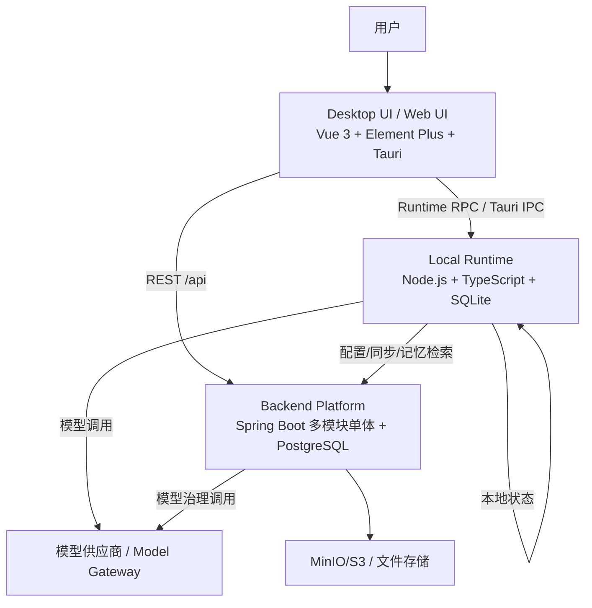
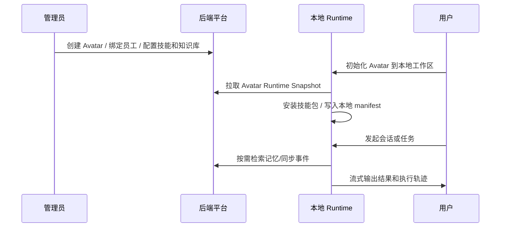
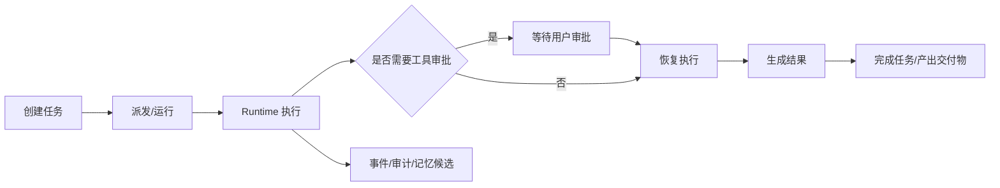
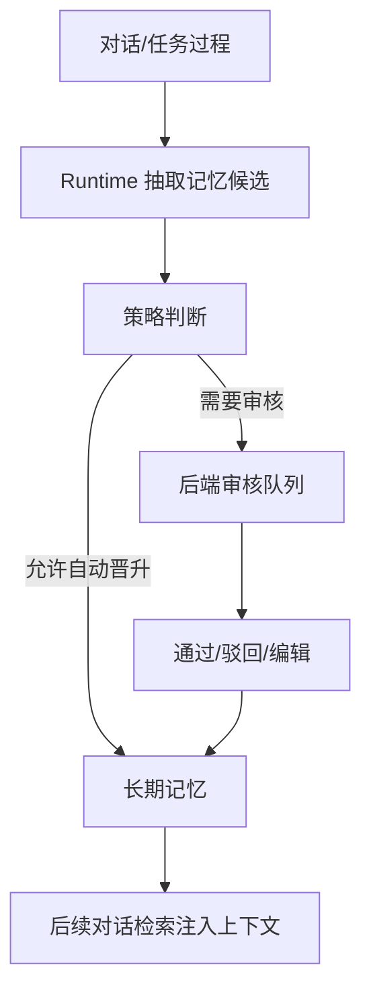

# Infinity Agent 产品设计与能力说明

> 适用目的：用于理解产品定位、设计方式、能力边界，并支持与其他 Agent 平台/智能体产品做横向对比。  
> 基于代码现状：`desktop-ui` + `runtime` + `backend` 当前实现，日期：2026-06-05。

## 1. 产品定位

Infinity Agent 是一个**本地优先的企业级通用 Agent 平台**，不是单一业务领域 Agent。

它的核心目标是让企业能够配置、运行、治理多个数字分身（Avatar）或 Agent 实例，并把对话、任务、工具调用、知识检索、长期记忆、模型调用、审批和审计放到统一平台中管理。

一句话概括：

> Infinity Agent 是一个以 Avatar 为入口、以本地 Runtime 为执行热路径、以后端平台为治理和持久化中心的企业 Agent 运行与治理框架。

它更接近以下产品类型：

| 类型 | 是否符合 | 说明 |
|------|----------|------|
| 单一客服/销售/研发 Agent | 否 | 当前没有绑定到单一行业或单一流程 |
| Agent 应用生成平台 | 部分符合 | 已具备 Avatar、技能、工具、知识、记忆、模型路由等 Agent 生成要素，但还不是完整低代码搭建器 |
| 企业 Agent Runtime | 符合 | 本地执行、工具调用、上下文、审批、事件追踪是核心能力 |
| Agent 治理平台 | 符合 | 后端提供任务账本、模型网关、记忆审核、审计、安全适配等治理能力 |
| 本地优先 AI 工作台 | 符合 | 桌面/Web UI + Runtime 模式支持本地真实对话和任务执行 |

## 2. 设计理念

### 2.1 本地优先

执行热路径优先发生在用户本机 Runtime 中，包括模型调用、工具调用、上下文管理、会话状态、任务执行事件等。

这种设计适合以下场景：

- 企业希望减少敏感数据直接进入云端平台。
- Agent 需要访问本地文件、工作区、命令行或浏览器能力。
- 用户需要离线/半离线体验，或在本地开发环境中使用 Agent。
- 企业希望把执行态和治理态分开管理。

### 2.2 服务端强治理

Java 后端不直接替代本地 Runtime 执行 Agent Loop，而是承担控制面能力：

- Avatar、员工、技能、知识库等配置管理。
- 任务账本、会话账本、状态流转。
- 模型供应商、模型目录、调用密钥、授权范围。
- 长期记忆审核、审计记录、认证适配。

因此整体是一个“本地执行 + 企业治理”的双层架构。

### 2.3 Avatar 作为 Agent 产品化载体

平台以 Avatar 表达一个可被用户选择、初始化和运行的 Agent 实例。Avatar 不是简单头像，而是一组运行配置：

- 角色提示词和行为边界。
- 可用技能。
- 可用工具与工具权限。
- 可访问知识库范围。
- 记忆策略。
- 本地工作区与 Runtime 快照。

这让同一个平台可以承载多个不同职责的 Agent。

### 2.4 Chat 与 Task 统一到 Runtime 执行

产品同时支持自由会话和结构化任务：

- Chat 面向即时交流、流式回复、工具轨迹展示。
- Task 面向目标、输入、输出、验收标准、状态追踪和拆分执行。

两者最终都依赖 Runtime 的执行能力，包括上下文构建、模型调用、工具调用、审批拦截和事件流。

## 3. 总体架构

### 3.1 前端层

路径：`apps/desktop-ui`

主要页面：

| 页面 | 作用 |
|------|------|
| Dashboard | 总览、状态入口 |
| ChatSessionPage | 会话、流式消息、执行轨迹、审批交互 |
| TaskBoardPage | 任务看板、任务运行、拆分、完成 |
| AvatarManagePage | Avatar 管理、员工绑定、技能和知识配置 |
| RuntimeSettingsPage | 本地 Runtime 模型、连接和运行配置 |
| StartupInitializationPage | 启动初始化引导 |
| VcrRecordingsPage / VcrDetailPage | 运行录制/回放类能力入口，用于调试和复现 |

### 3.2 本地 Runtime 层

路径：`apps/runtime`

Runtime 是产品的执行引擎，主要负责：

- JSON-RPC / HTTP RPC / Tauri IPC 接入。
- Agent Loop 与 Step 执行。
- 模型 Provider 管理，支持直连模型和企业 Model Gateway。
- 本地 SQLite 状态存储。
- 工具注册、工具调用、权限判定。
- 上下文构建、上下文压缩、历史管理。
- Avatar 本地初始化、工作区管理、技能安装。
- Memory 抽取、候选写入、检索、晋升与同步。
- Subagent delegation、子任务/子 Agent 执行协作。
- 运行事件广播，供前端展示过程。

### 3.3 后端平台层

路径：`apps/backend`

后端是企业控制面和治理面，采用 Spring Boot 多模块单体：

| 模块 | 能力 |
|------|------|
| `platform-app` | 应用启动、安全、OpenAPI、上传、MinIO/S3 直传 |
| `platform-common` | 通用响应、异常、分页、上传接口、基础组件 |
| `module-avatar` | Avatar、员工、技能、知识库、生命周期事件 |
| `module-chat` | 聊天会话和消息账本 |
| `module-task-ledger` | 任务创建、派发、运行、取消、挂起、恢复、拆分、完成 |
| `module-memory` | 长期记忆、候选审核、记忆检索、记忆合并 |
| `module-knowledge-gateway` | 文档上传解析、切块、检索、RRF 融合 |
| `module-model-gateway` | 模型供应商、模型目录、调用密钥、授权、Chat/Embedding/Rerank |
| `module-audit` | 审计记录、Runtime 上下文审计摘要 |
| `module-auth-adapter` | 企业认证适配、当前用户上下文 |
| `module-policy` | 策略/审批域骨架 |
| `module-runtime-registry` | Runtime 注册表骨架 |
| `model-gateway-java-sdk` | 模型网关 Java SDK |

## 4. 产品能力地图

### 4.1 Agent / Avatar 管理

平台支持以 Avatar 形式管理 Agent 实例：

- Avatar 分页、详情、创建、更新、删除。
- 从模板创建员工绑定实例。
- 查询 Runtime 分身快照。
- Avatar 生命周期事件拉取和确认。
- 员工登记、员工分身绑定、员工视角 Avatar 管理视图。
- 技能候选、工具候选、知识库范围候选。
- 技能包上传、创建、更新、删除、ZIP 条目浏览、文本预览、下载。
- 知识库创建、分页、详情、更新、删除。

产品价值：

- 支持一个企业内存在多个 Agent 实例。
- 支持按照员工、租户、技能、知识范围进行配置。
- Agent 不只是 Prompt，而是由身份、技能、工具、知识、记忆和运行环境共同组成。

### 4.2 会话能力

会话模块提供用户和 Avatar 的自然语言交互入口：

- 创建会话。
- 分页列举会话。
- 查询会话详情。
- 追加消息。
- 列举消息。
- 归档、挂起、恢复、取消会话。
- 前端支持流式展示、运行状态、工具轨迹、计划状态和审批交互。

产品价值：

- 支持自由对话和协作式执行。
- 适合作为个人 AI 工作台、企业内部助手和任务入口。

### 4.3 任务能力

任务模块把 Agent 执行从“聊天”提升为可管理的工作单元：

- 创建任务。
- 分页和详情查询。
- 更新未开始任务，并使用版本号做乐观锁。
- 派发任务。
- 运行任务。
- 取消任务和批量取消。
- 挂起、恢复。
- 补充任务输入。
- 按会话查询运行中任务。
- 标记任务完成。
- 查询子任务。
- 自动拆分子任务。

产品价值：

- 支持目标驱动的 Agent 工作方式。
- 便于管理长任务、复杂任务和多人/多 Agent 协同。
- 可以与任务看板、状态机、执行事件和最终交付物结合。

### 4.4 本地 Runtime 执行能力

Runtime 是 Infinity Agent 与普通 Web Chatbot 最大的差异之一。

当前 Runtime 能力包括：

- `runtime.runExecution` 一类运行入口，支持启动、恢复、取消。
- 会话状态、执行状态、Step 状态管理。
- Session Lane Scheduler，避免同一会话并发执行互相污染。
- Checkpoint 和本地 SQLite 状态。
- 运行事件输出到 stdout / SSE / IPC。
- Runtime 配置热更新。
- 直连模型 Provider 和 Gateway Provider。
- VCR 录制/回放相关能力，用于复现模型或工具交互。

产品价值：

- 允许 Agent 真正操作本地环境，而不是只在服务端生成文本。
- 执行状态保存在本地，适合恢复、调试、离线/半离线运行。
- 企业可以把敏感执行上下文留在终端侧。

### 4.5 工具体系

Runtime 内置多类工具：

| 工具类型 | 示例能力 |
|----------|----------|
| 文件工具 | 读取、列表、统计、树、写入、编辑、补丁、移动、删除、建目录 |
| 搜索工具 | 工作区搜索、文本搜索、Web 搜索 |
| 执行工具 | Shell、Python、Node、本地进程执行 |
| 网络工具 | HTTP GET、公网网络访问策略 |
| 浏览器工具 | 页面读取、截图 |
| 任务工具 | 任务拆分、任务完成 |
| 记忆工具 | 长期记忆检索 |
| Delegation 工具 | 创建子 Agent / 子任务执行 |

同时具备工具治理能力：

- 工具风险分级。
- 路径策略。
- 网络策略。
- Approval Policy Bridge。
- Tool Policy Guard。
- 人工审批恢复流程。

产品价值：

- 支持从“问答 Agent”升级为“执行 Agent”。
- 可以对高风险工具调用进行审批和边界控制。

### 4.6 上下文与记忆

Runtime 侧已经具备较完整的上下文管理：

- Context Builder。
- Context Manager。
- Context History。
- Prompt Preparer。
- Token Estimator。
- Replacement Compactor。
- Turn Context Factory。
- Skill Context Injector。

Memory 能力包括：

- Working Memory。
- Memory Write Buffer。
- Memory Extractor。
- Memory Policy Gate。
- Memory Promotion Service。
- Memory Search Service。
- Memory Sync Service。
- 后端 Memory Review Queue。
- 后端 Memory Consolidator，用于重复、冲突和替代关系处理。

产品价值：

- Agent 能跨轮次、跨任务沉淀偏好、事实、经验和教训。
- 长期记忆不是直接写入，而是经过策略和审核，适合企业治理。
- 上下文压缩和历史管理为长对话/长任务提供基础。

### 4.7 知识网关

知识网关负责把企业文档转化为可检索上下文：

- 单文档上传并解析。
- 批量文档上传。
- 查询文档详情与解析状态。
- 删除文档。
- 检索接口 `/api/v1/knowledge-gateway/retrieve`。
- Debug 检索接口。
- 文档切块。
- 中文稀疏检索。
- 语义检索。
- Reciprocal Rank Fusion 融合排序。
- 通过 Model Gateway 生成 Embedding 或调用 LLM。

产品价值：

- 支持企业知识接入 Agent。
- 检索能力独立成网关，便于统一调优和治理。

### 4.8 模型网关

模型网关负责统一模型调用和企业级模型治理：

- Chat Completions。
- Embeddings。
- Text Rerank。
- 当前调用方可用模型目录。
- 模型供应商 CRUD。
- 从供应商拉取模型列表。
- 模型注册 CRUD。
- 调用密钥 CRUD。
- 调用密钥 reveal。
- 模型授权保存和查询。
- 用户虚拟 Key。
- 路由解析和路由缓存。
- 调用账本记录。
- 支持 OpenAI、Anthropic、TranAI Rerank 等适配方向。

产品价值：

- 避免 Runtime 或业务模块直接散落管理 API Key。
- 支持按租户、用户、调用方、模型授权进行治理。
- 便于企业切换模型供应商或统一审计模型调用。

### 4.9 Subagent / Delegation

Runtime 已引入较完整的 delegation 体系：

- Delegation Service。
- Subagent Dispatcher。
- Context Fork Builder。
- Permission Converger。
- Delegation Policy Converger。
- Runtime Hook Manager。
- Hook Event Repository。
- Delegation Trace Collector。
- Final Report Collector。
- Delegation Template Registry / Resolver / Repository。
- Delegation Sync Service 和 Outbox。
- Delegation Stats。

产品价值：

- 支持复杂任务拆给子 Agent 或专门执行单元。
- 支持父子执行链路追踪、上下文分叉、权限收敛和结果汇总。
- 这是从单 Agent 走向多 Agent 协同的关键基础。

### 4.10 治理、审计与认证

治理能力贯穿前后端和 Runtime：

- 企业认证适配。
- 当前认证上下文。
- 会话内审批。
- 工具调用风险控制。
- 记忆候选审核。
- 审计记录查询。
- Runtime 上下文审计摘要上报。
- 模型调用账本。
- API Key 和模型授权治理。

产品价值：

- 面向企业环境，而不是个人 Demo Chatbot。
- 支持“能执行，但可控、可查、可追责”。

## 5. 典型产品流程

### 5.1 创建并运行一个企业 Avatar

### 5.2 任务执行与治理

### 5.3 记忆治理

## 6. 和其他产品对比时建议看的维度

| 对比维度 | Infinity Agent 当前特征 |
|----------|--------------------------|
| 产品定位 | 通用 Agent 平台，偏企业本地优先工作台和运行治理框架 |
| 是否单一领域 | 否，可承载多个 Avatar/Agent |
| Agent 配置方式 | Avatar + Prompt + 技能 + 工具 + 知识库 + 记忆策略 + Runtime Snapshot |
| 执行位置 | 本地 Runtime 为主，后端做控制面 |
| 工具能力 | 本地文件、命令、搜索、浏览器、任务、记忆、delegation 等 |
| 长任务能力 | Task Ledger、状态机、拆分、完成、运行中任务绑定 |
| 多 Agent 能力 | Runtime 已有 delegation/subagent 基础 |
| 知识能力 | 文档解析、切块、语义/稀疏检索、RRF、Debug 检索 |
| 记忆能力 | Working memory、候选、审核、晋升、同步、冲突合并 |
| 模型治理 | Model Gateway、供应商、模型目录、密钥、授权、路由缓存、调用账本 |
| 安全治理 | 工具策略、审批桥、审计、认证适配、模型授权 |
| 部署方式 | Monorepo，本地 Runtime + Java 后端 + 桌面/Web UI |
| 适合客户 | 重视本地执行、企业治理、知识/记忆/工具闭环的组织 |
| 不适合场景 | 只需要轻量聊天机器人、单一 FAQ Bot、纯 SaaS 无本地执行要求的场景 |

## 7. 当前优势

1. **本地执行优势明显**  
   能访问本地工作区和工具链，适合研发、运维、知识工作者、内部数据敏感场景。

2. **企业治理骨架完整**  
   模型网关、审计、认证、记忆审核、工具审批等能力已经形成体系。

3. **Agent 不只是 Prompt**  
   Avatar 把角色、技能、工具、知识、记忆、工作区和快照组合成可管理实体。

4. **从 Chat 到 Task 再到 Delegation**  
   产品形态覆盖自由会话、结构化任务和多 Agent 协同基础。

5. **知识和记忆都可治理**  
   知识走网关检索，记忆走候选和审核，适合企业可控沉淀。

## 8. 当前边界与成熟度判断

当前产品已经不是简单 Demo，但仍处于平台能力快速演进阶段。对外对比时建议如实区分“已实现能力”和“平台方向”。

| 能力 | 成熟度判断 |
|------|------------|
| Avatar 管理 | 已有较完整后端接口和前端入口 |
| Chat + Runtime 对话 | 已具备真实执行链路 |
| Task Ledger | 已有较完整状态接口，复杂执行编排仍在演进 |
| 工具体系 | Runtime 内置较丰富，治理能力持续增强 |
| Memory | Runtime + Backend 已形成闭环，产品体验仍需持续打磨 |
| Knowledge Gateway | 已有文档解析和检索主链路 |
| Model Gateway | 能力较完整，是企业级差异点 |
| Subagent Delegation | Runtime 基础较丰富，前端产品化仍需加强 |
| 低代码 Agent 生成器 | 尚不是核心形态，更多是配置型平台底座 |
| 商业化多租户运营后台 | 有租户/授权基础，但运营后台能力还可补齐 |

## 9. 适合拿来对标的产品类型

建议不要只和“聊天机器人”对比，而是分层对标：

| 对标类型 | 对比重点 |
|----------|----------|
| Dify / Coze / Langflow 类 Agent 编排平台 | Agent 配置、工作流、知识库、工具扩展、发布方式 |
| OpenAI Assistants / Responses API 应用 | 工具调用、线程/记忆、文件检索、模型能力、API 简洁度 |
| Cursor / Devin / Codex 类研发 Agent | 本地工具、任务执行、代码工作区、审批、执行追踪 |
| 企业 Model Gateway | 模型供应商治理、密钥、授权、审计、路由、成本管理 |
| 企业知识库/RAG 平台 | 文档解析、检索质量、Debug、权限、知识更新 |
| 内部 AI 工作台 | 登录、会话、任务、分身、审计、桌面端体验 |

## 10. 产品差异化总结

Infinity Agent 的差异化不是“有一个会聊天的 Agent”，而是：

- 以 Avatar 管理企业中的多个 Agent 实例。
- 以本地 Runtime 承担真实执行。
- 以 Java 后端承担企业治理。
- 把 Chat、Task、Tool、Knowledge、Memory、Model Gateway、Audit 组合成一个闭环。
- 为多 Agent delegation 和复杂任务执行预留了底层能力。

最终产品愿景可以表述为：

> 一个本地优先、企业可治理、可扩展多 Agent 的智能执行平台，让企业可以安全地创建、运行、管理和审计自己的数字分身与 Agent 工作流。

