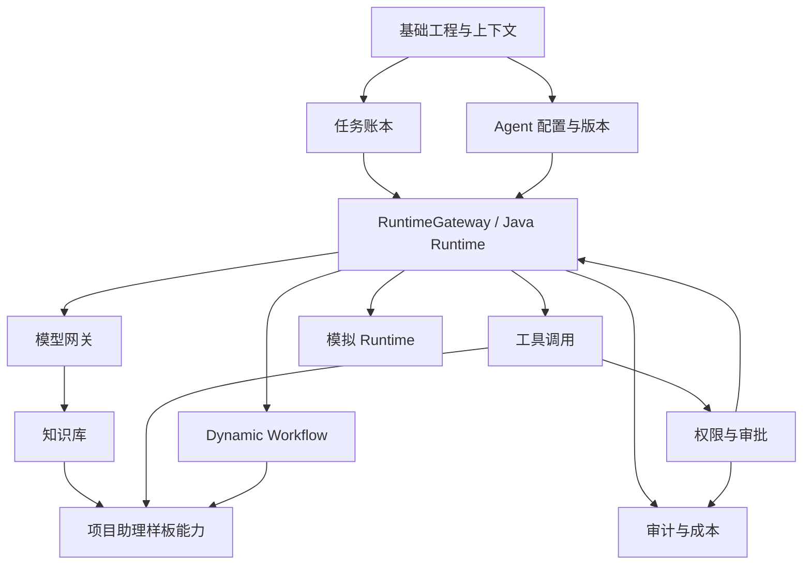

# 项目助理 Agent MVP 开发任务拆分

> 日期：2026-06-08  
> 输入文档：`docs/req/20260604_企业数字员工平台_需求.md`、`docs/design/20260604_企业数字员工平台_技术.md`  
> 拆分目标：围绕项目助理 Agent 端到端执行闭环，明确 MVP 模块、优先级、依赖关系、交付物和验收建议。

## 1. MVP 交付目标

第一阶段只验证“项目助理 Agent 能完成真实复杂工作”，不建设完整企业数字员工平台。平台化能力先作为支撑项目助理 Agent 的最小护栏和架构预留，不作为当前交付主线。

MVP 需要打通以下用户价值闭环：

1. 用户输入真实项目请求、会议纪要、项目资料或项目问题。
2. 项目助理 Agent 理解目标，必要时澄清交付物、约束和缺失信息。
3. Agent 使用项目知识、用户资料或样例上下文形成判断依据。
4. Agent 展示执行过程、关键判断、知识依据、工具动作和等待事项。
5. 高风险动作触发确认或审批，任务可以挂起。
6. 审批通过后任务可以恢复，审批拒绝后给出可理解反馈。
7. Agent 输出可直接复用的交付物，包括周报、行动项、风险清单和建议动作。
8. 任务、工具调用、知识访问、审批和基础成本有必要记录，便于追踪和排障。

## 2. MVP 不做范围

为控制第一阶段复杂度，以下能力不纳入 MVP 主线：

- 完整 Agent 模板市场。
- 完整多领域 Agent 平台化创建闭环。
- 完整模型、工具、策略、租户、审计、成本管理后台。
- 完整 MCP Registry。
- 完整多 Agent Swarm。
- 完整可视化 Workflow 画布。
- 用户自定义复杂 Workflow。
- 完整 RPA 平台。
- 完整沙箱执行环境。
- 完整运行录制回放。
- 完整 FinOps 平台。
- 完整本地 TypeScript Runtime。
- 完整企业内网 Runtime 注册治理。
- 高级 ABAC/ReBAC 权限引擎。
- 全渠道同时接入。

## 3. 模块优先级

| 优先级 | 模块 | 目标 |
|---|---|---|
| P0 | Agent Workbench 与任务详情 | 提供用户真正使用项目助理 Agent 的入口 |
| P0 | 项目助理样板能力 | 做好会议纪要、周报、风险分析三类核心输出 |
| P0 | 任务账本与 Runtime 事件 | 承载任务状态、运行记录、执行过程和交付物 |
| P0 | 知识库最小能力 | 支持项目资料检索、来源展示和输出依据 |
| P0 | 模型网关最小能力 | 统一模型调用、token 统计和后续真实模型接入 |
| P0 | 工具调用最小能力 | 支持当前项目助理需要的受控工具调用 |
| P0 | 权限与审批 | 支持高风险动作挂起、审批和恢复 |
| P0 | 身份与租户上下文 | 保证当前 Agent 数据有企业边界 |
| P1 | Agent 配置与版本最小能力 | 只支持项目助理 Agent 的最小配置、试用和运行快照 |
| P1 | Agent 质量打磨 | 提升任务理解、知识依据、交付物结构和失败恢复体验 |
| P1 | 审计与成本记录 | 支持基础追踪和成本保护，不建设完整后台 |
| P2 | 企业聊天渠道 | 在 Workbench 跑通后接入一个企业聊天工具 |
| P2 | 模拟 Runtime / 可插拔 Runtime 验证 | 作为后续平台化验证项，不阻塞项目助理 Agent 可用性 |

## 4. 开发阶段划分

### 4.1 阶段一：基础骨架

目标：建立后端模块边界、基础数据模型和前端入口。

任务：

| 编号 | 任务 | 交付物 | 依赖 |
|---|---|---|---|
| M1-01 | 搭建 Java 后端工程模块 | Spring Boot 工程、公共模块、启动模块 | 无 |
| M1-02 | 定义统一响应与异常 | Response、ErrorCode、GlobalExceptionHandler | M1-01 |
| M1-03 | 定义租户与用户上下文 | TenantContext、UserContext、请求拦截器 | M1-01 |
| M1-04 | 定义基础审计字段规范 | createdBy、createdAt、updatedBy、updatedAt、tenantId | M1-01 |
| M1-05 | 搭建前端工程入口 | 登录占位、Chat 页面占位、任务页面占位 | 无 |
| M1-06 | 设计数据库初始化脚本 | 基础表结构 SQL | M1-01 |

验收建议：

- 后端可启动。
- 前端可启动。
- API 返回统一结构。
- 请求上下文能解析 tenantId 和 userId。
- 核心表包含 tenantId 和审计字段。

### 4.2 阶段二：Agent 配置与版本

目标：支持创建项目助理 Agent 并生成运行快照。

任务：

| 编号 | 任务 | 交付物 | 依赖 |
|---|---|---|---|
| M2-01 | Agent 基础表设计 | agent、agent_version、agent_publish_scope | M1-06 |
| M2-02 | Agent 草稿创建接口 | 创建项目助理 Agent 草稿 API | M2-01 |
| M2-03 | Agent 配置编辑接口 | 角色、职责、边界、知识、工具、权限、预算 | M2-02 |
| M2-04 | Agent 版本生成接口 | 生成不可变版本快照 | M2-03 |
| M2-05 | Agent 白名单发布接口 | 发布到指定用户或部门 | M2-04 |
| M2-06 | Agent 回滚接口 | 回滚到上一稳定版本 | M2-04 |
| M2-07 | Runtime 快照生成 | AgentRuntimeSnapshot DTO | M2-04 |
| M2-08 | Agent 管理前端页面 | 创建、编辑、发布、回滚基础页面 | M2-02 |

验收建议：

- 能创建项目助理 Agent 草稿。
- 能编辑基础配置。
- 能生成版本。
- 能发布给白名单用户。
- Runtime 可以拿到执行快照。

### 4.3 阶段三：任务账本

目标：支撑任务创建、运行、挂起、恢复、取消和完成。

任务：

| 编号 | 任务 | 交付物 | 依赖 |
|---|---|---|---|
| M3-01 | 任务账本表设计 | task、task_run、task_step、task_event | M1-06 |
| M3-02 | 创建任务接口 | CreateTask API | M3-01 |
| M3-03 | 查询任务接口 | 任务列表、详情、运行详情 | M3-02 |
| M3-04 | 更新任务状态服务 | pending、running、suspended、completed、failed、cancelled | M3-02 |
| M3-05 | 任务事件落库 | RuntimeEvent 持久化 | M3-04 |
| M3-06 | 任务取消接口 | CancelTask API | M3-04 |
| M3-07 | 任务进度前端页面 | 步骤、状态、事件、中间结果展示 | M3-03 |

验收建议：

- 用户可创建任务。
- 任务状态流转可追踪。
- 任务事件可落库。
- 前端可看到任务进度。

### 4.4 阶段四：RuntimeGateway 与 Java Runtime

目标：以可插拔 Runtime 接口打通 Java MVP 执行链路。

任务：

| 编号 | 任务 | 交付物 | 依赖 |
|---|---|---|---|
| M4-01 | 定义 RuntimeGateway 接口 | startRun、cancelRun、resumeRun、submitUserInput、submitApprovalResult | M3-01 |
| M4-02 | 定义 RunStartCommand | tenantId、userId、agentId、taskId、runId、snapshot、traceId | M4-01 |
| M4-03 | 定义 RuntimeEvent 协议 | RUN_STARTED、STEP_STARTED、TOOL_CALL、APPROVAL_REQUIRED 等 | M4-01 |
| M4-04 | 实现 JavaInProcessRuntimeGateway | Java 内置 Runtime 实现 | M4-01 |
| M4-05 | Runtime 事件回写任务账本 | 事件到 task_event 和状态变更 | M3-05 |
| M4-06 | Runtime 取消处理 | cancelRun 停止执行并回写状态 | M4-04 |
| M4-07 | Runtime 流式输出 | SSE 或 WebSocket 事件输出 | M4-05 |
| M4-08 | 前端接入运行事件 | Chat 和任务进度实时刷新 | M4-07 |

验收建议：

- Java 后端可通过 RuntimeGateway 启动任务。
- Runtime 事件能统一回写任务账本。
- 前端不直接依赖 Runtime。
- 取消任务后 Runtime 能停止并落状态。

### 4.5 阶段五：模型网关最小能力

目标：统一模型调用入口，避免业务代码直接绑定模型供应商。

任务：

| 编号 | 任务 | 交付物 | 依赖 |
|---|---|---|---|
| M5-01 | 模型供应商表设计 | model_provider、model_config、model_call_log | M1-06 |
| M5-02 | 模型配置接口 | 创建、查询、启停模型配置 | M5-01 |
| M5-03 | Chat 调用接口 | ModelGateway.chat | M5-02 |
| M5-04 | Embedding 调用接口 | ModelGateway.embedding | M5-02 |
| M5-05 | token 使用记录 | model_call_log 落库 | M5-03 |
| M5-06 | 调用失败封装 | 超时、限流、模型错误统一异常 | M5-03 |
| M5-07 | Runtime 接入模型网关 | Java Runtime 调用 ModelGateway | M4-04 |

验收建议：

- Runtime 不直接调用模型供应商。
- 模型调用有日志。
- token 或调用量有基础统计。
- 模型失败可返回可理解错误。

### 4.6 阶段六：知识库最小能力

目标：支持项目资料上传、检索和来源展示。

任务：

| 编号 | 任务 | 交付物 | 依赖 |
|---|---|---|---|
| M6-01 | 知识库表设计 | knowledge_base、knowledge_document、knowledge_chunk | M1-06 |
| M6-02 | 文档上传接口 | 文件上传、元数据入库 | M6-01 |
| M6-03 | 文档解析与切块 | 基础文本抽取、chunk 入库 | M6-02 |
| M6-04 | Embedding 生成 | 调用模型网关 embedding | M5-04 |
| M6-05 | 知识检索接口 | retrieve API | M6-04 |
| M6-06 | 来源展示 | chunk 来源、文档名、片段位置 | M6-05 |
| M6-07 | Runtime 接入知识检索 | Java Runtime 检索项目资料 | M4-04 |
| M6-08 | 知识库前端页面 | 上传、列表、检索调试 | M6-02 |

验收建议：

- 能上传项目资料。
- 能完成基础切块和检索。
- Agent 回答能展示来源。
- 无权或无结果时能明确说明。

### 4.7 阶段七：工具调用最小能力

目标：支持 Agent 在权限边界内调用 HTTP/内置工具。

任务：

| 编号 | 任务 | 交付物 | 依赖 |
|---|---|---|---|
| M7-01 | 工具表设计 | tool_config、agent_tool_binding、tool_call_log | M1-06 |
| M7-02 | 工具配置接口 | HTTP/OpenAPI 工具注册 | M7-01 |
| M7-03 | Agent 绑定工具 | Agent 可用工具范围配置 | M7-02 |
| M7-04 | 工具调用执行器 | HTTP 工具调用、参数校验、超时控制 | M7-03 |
| M7-05 | 工具调用日志 | 请求摘要、结果摘要、耗时、状态 | M7-04 |
| M7-06 | 工具风险等级 | low、medium、high | M7-02 |
| M7-07 | Runtime 接入工具调用 | Java Runtime 调用 ToolExecutor | M4-04 |

验收建议：

- Agent 只能看到已绑定工具。
- 工具调用有日志。
- 高风险工具不能直接绕过审批。
- 工具失败能进入失败路径。

### 4.8 阶段八：权限与审批

目标：支持高风险动作确认、动态审批、挂起和恢复。

任务：

| 编号 | 任务 | 交付物 | 依赖 |
|---|---|---|---|
| M8-01 | 权限策略表设计 | policy_rule、approval_request、approval_record | M1-06 |
| M8-02 | 策略判断服务 | allow、confirm、approve、deny | M8-01 |
| M8-03 | 审批路由服务 | 策略指定审批人、企业管理员兜底 | M8-02 |
| M8-04 | 发起审批接口 | 创建 approval_request | M8-03 |
| M8-05 | 审批处理接口 | approve、reject、timeout | M8-04 |
| M8-06 | Runtime 挂起事件 | APPROVAL_REQUIRED、RUN_SUSPENDED | M4-03 |
| M8-07 | 审批通过恢复 Runtime | submitApprovalResult、resumeRun | M4-01 |
| M8-08 | 审批前端交互 | 审批卡片、通过、拒绝、状态展示 | M8-04 |

验收建议：

- 高风险工具触发审批。
- 审批请求能路由到审批人。
- 审批通过后任务继续执行。
- 审批拒绝后任务给出替代路径或失败原因。

### 4.9 阶段九：Dynamic Workflow

目标：支持复杂任务内部拆解和过程展示。

任务：

| 编号 | 任务 | 交付物 | 依赖 |
|---|---|---|---|
| M9-01 | 复杂度判断 | simple、medium、complex | M4-04 |
| M9-02 | 计划生成 | 目标、输入、约束、步骤、交付物 | M5-07 |
| M9-03 | 步骤执行器 | 顺序执行、失败处理、中间结果 | M9-02 |
| M9-04 | 步骤限制 | 最大步骤数、最长执行时间、token 上限 | M9-03 |
| M9-05 | 中间结果展示 | task_step、task_event 展示 | M3-07 |
| M9-06 | 用户补充信息 | USER_INPUT_REQUIRED、submitUserInput | M4-01 |
| M9-07 | 自检与汇总 | 最终结果生成和来源/不确定性标注 | M9-03 |

验收建议：

- 项目周报和风险分析能进入 Dynamic Workflow。
- 每个步骤可追踪。
- 超出限制能降级或终止。
- 最终结果不是只有过程说明，而是可用交付物。

### 4.10 阶段十：项目助理样板能力

目标：完成 MVP 推荐样板场景。

任务：

| 编号 | 任务 | 交付物 | 依赖 |
|---|---|---|---|
| M10-01 | 项目知识问答 | 基于知识检索回答并展示来源 | M6-07 |
| M10-02 | 会议纪要生成 | 提取结论、行动项、责任人、时间、风险 | M5-07 |
| M10-03 | 会议纪要转任务 | 生成任务草稿，用户确认后调用工具创建 | M7-07、M8-02 |
| M10-04 | 项目周报生成 | 本周进展、风险、下周计划、待协调事项 | M9-07 |
| M10-05 | 项目风险分析 | 风险描述、依据、影响、建议动作 | M9-07 |
| M10-06 | 用户取消任务 | 取消运行并保留已有结果 | M4-06 |
| M10-07 | 失败反馈 | 失败环节、原因、下一步建议 | M3-05 |

验收建议：

- 会议纪要生成结果结构化。
- 会议纪要转任务需要用户确认。
- 周报内容可直接使用。
- 风险分析带依据和建议。
- 失败时用户能理解原因。

### 4.11 阶段十一：审计与成本

目标：满足 MVP 最小治理护栏。

任务：

| 编号 | 任务 | 交付物 | 依赖 |
|---|---|---|---|
| M11-01 | 审计表设计 | audit_log、security_event | M1-06 |
| M11-02 | 用户请求审计 | 用户、Agent、任务、渠道 | M3-02 |
| M11-03 | 工具调用审计 | 工具、参数摘要、结果摘要、风险等级 | M7-05 |
| M11-04 | 知识访问审计 | 知识库、文档、chunk、来源 | M6-05 |
| M11-05 | 审批审计 | 审批人、动作、原因、时间 | M8-05 |
| M11-06 | token 预算限制 | Agent 日预算、单任务 token 上限 | M5-05 |
| M11-07 | 超限保护 | 超限终止、降级或提示 | M11-06 |

验收建议：

- 关键行为可追踪到用户、Agent、任务和租户。
- token 超限能保护。
- 审计记录不直接暴露完整敏感上下文。

### 4.12 阶段十二：模拟 Runtime（后续平台化验证项）

目标：验证未来 TypeScript Runtime 接入时不需要改动核心业务链路。该阶段服务于后续平台化和 Runtime 可插拔验证，不阻塞当前项目助理 Agent 做到好用。

任务：

| 编号 | 任务 | 交付物 | 依赖 |
|---|---|---|---|
| M12-01 | MockRuntimeGateway 实现 | 模拟远程 Runtime 返回事件 | M4-01 |
| M12-02 | Runtime 类型配置 | java-in-process、mock-remote | M12-01 |
| M12-03 | 事件兼容测试 | Mock 事件可驱动任务账本 | M12-01 |
| M12-04 | 审批挂起恢复测试 | Mock Runtime 支持审批恢复 | M8-07 |
| M12-05 | 失败事件测试 | Mock Runtime 上报 RUN_FAILED | M3-05 |

验收建议：

- 切换 Runtime 实现不影响任务 API。
- 前端仍只通过 Java 后端看事件。
- 任务状态仍以 Java 后端为准。

## 5. 推荐开发顺序

当前主线先围绕项目助理 Agent 可用性推进；平台化验证项在 Agent 体验稳定后再做。

```text
阶段一：基础骨架
阶段二：项目助理 Agent 最小配置与运行快照
阶段三：任务账本
阶段四：RuntimeGateway 与 Java Runtime
阶段五：模型网关最小能力
阶段六：知识库最小能力
阶段七：工具调用最小能力
阶段八：权限与审批
阶段九：项目助理场景化执行流程
阶段十：项目助理样板能力与交付物质量
阶段十一：最小审计与成本护栏
阶段十二：模拟 Runtime（后续平台化验证项）
```

## 5.1 下一阶段：Agent 质量打磨

在已有工作台、任务、Runtime、审批、知识和交付物闭环基础上，下一阶段优先提升“项目助理是否真的好用”：

- 改善会议纪要转行动项输出质量，明确责任人、截止时间、待确认事项和可执行任务草稿。
- 改善项目周报结构和可复制性，稳定输出本周进展、风险、阻塞、下周计划和需协调事项。
- 改善风险分析的依据、影响、严重程度、建议动作和不确定信息标注。
- 明确知识来源展示，让用户知道 Agent 的判断来自哪些资料或输入。
- 完善审批恢复体验，让用户理解为什么审批、审批后继续了什么、拒绝后影响是什么。
- 增加端到端 Workbench smoke checklist，覆盖输入、执行事件、审批、恢复、交付物和任务详情。

## 6. 关键依赖关系



## 7. 数据库设计前置清单

后续 SQL 设计建议先覆盖以下表：

| 分类 | 表 |
|---|---|
| 租户与用户 | tenant、user_account、user_identity_mapping |
| Agent | agent、agent_version、agent_publish_scope、agent_tool_binding、agent_knowledge_binding |
| 任务 | task、task_run、task_step、task_event、task_artifact |
| Runtime | runtime_node、runtime_run_snapshot |
| 模型 | model_provider、model_config、model_call_log |
| 知识 | knowledge_base、knowledge_document、knowledge_chunk |
| 工具 | tool_config、tool_call_log |
| 权限审批 | policy_rule、approval_request、approval_record |
| 审计成本 | audit_log、security_event、budget_policy、usage_record |

## 8. 接口设计前置清单

后续 Controller 设计建议优先覆盖：

| 模块 | 接口 |
|---|---|
| Agent | 创建草稿、编辑配置、生成版本、发布、回滚、查询快照 |
| Chat/Task | 创建任务、发送消息、查询任务、取消任务、查询事件 |
| Runtime | 启动运行、取消运行、恢复运行、提交用户输入、提交审批结果 |
| Model | 模型配置、模型调用日志、模型授权 |
| Knowledge | 上传文档、解析状态、检索、查询来源 |
| Tool | 注册工具、绑定 Agent、调用测试、查询调用日志 |
| Policy | 策略配置、策略判断、审批路由 |
| Approval | 创建审批、审批通过、审批拒绝、审批详情 |
| Audit | 查询审计记录、查询任务轨迹 |

## 9. 测试策略

### 9.1 单元测试

- Agent 快照生成。
- 任务状态流转。
- RuntimeEvent 到任务状态转换。
- 权限策略判断。
- 审批路由。
- token 超限判断。
- 工具参数校验。

### 9.2 集成测试

- 创建 Agent 并发布到白名单。
- 创建任务并启动 Java Runtime。
- Runtime 调用模型网关。
- Runtime 调用知识检索。
- Runtime 调用工具。
- 高风险工具触发审批。
- 审批通过后恢复任务。
- 任务取消后停止执行。

### 9.3 端到端测试

- 项目知识问答。
- 会议纪要生成。
- 会议纪要转任务。
- 项目周报生成。
- 项目风险分析。
- 权限不足审批恢复。
- token 超限保护。
- 工具失败恢复提示。

## 10. 交付检查清单

MVP 完成前至少满足：

- [ ] 有一个可发布的项目助理 Agent。
- [ ] 普通用户能从 Web Chat 发起任务。
- [ ] 任务可进入 Java Runtime 执行。
- [ ] 复杂任务可展示步骤。
- [ ] 知识问答能展示来源。
- [ ] 会议纪要能生成结构化结果。
- [ ] 周报能输出可用交付物。
- [ ] 风险分析能输出依据和建议。
- [ ] 高风险动作能审批挂起。
- [ ] 审批通过后能恢复执行。
- [ ] 用户能取消任务。
- [ ] 工具调用、知识访问、审批和模型调用有基础记录。
- [ ] token 超限有保护。
- [ ] MockRuntimeGateway 能验证未来 Runtime 可插拔。

